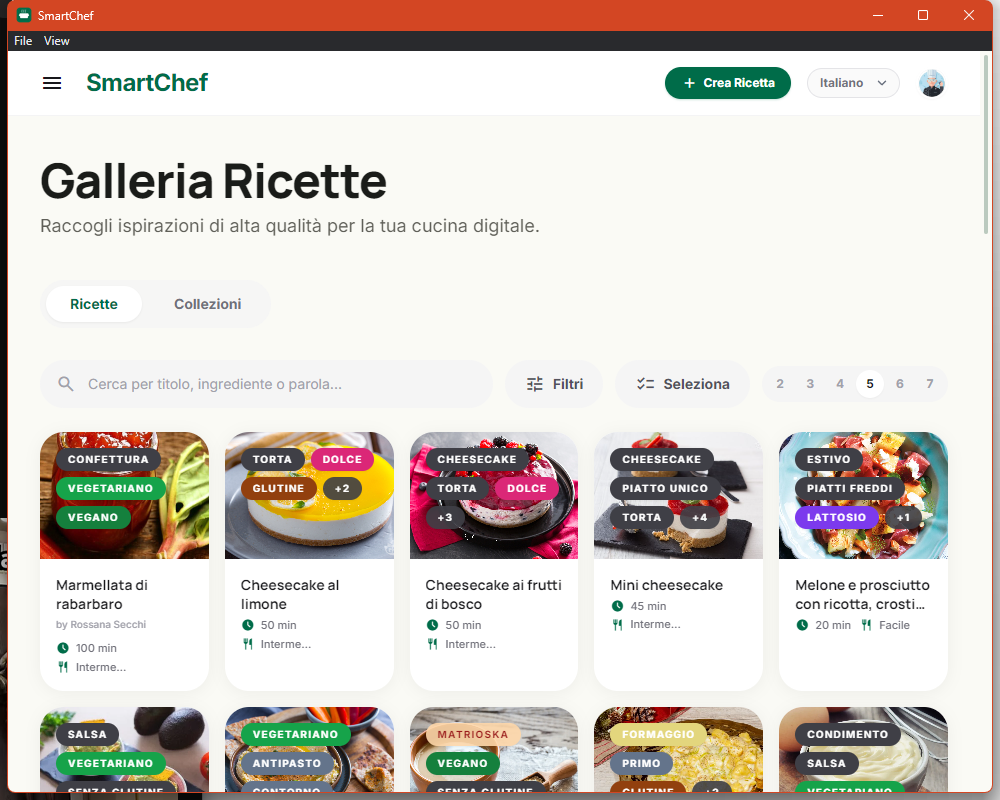
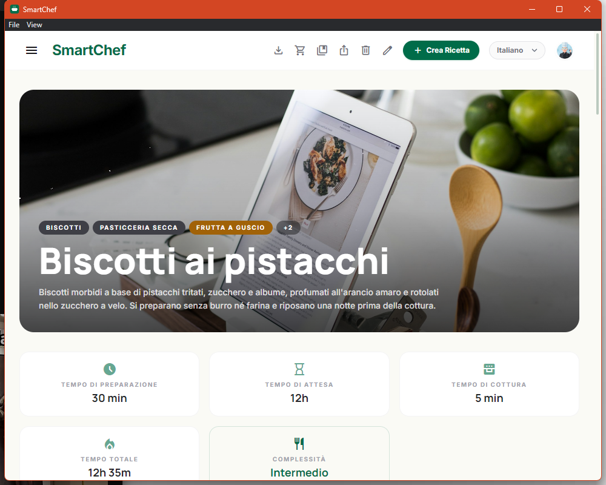
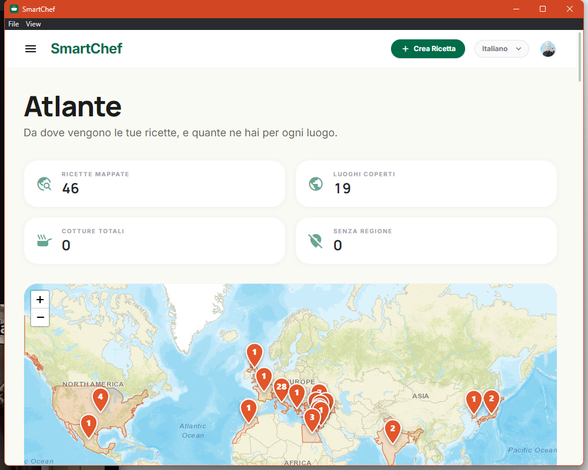
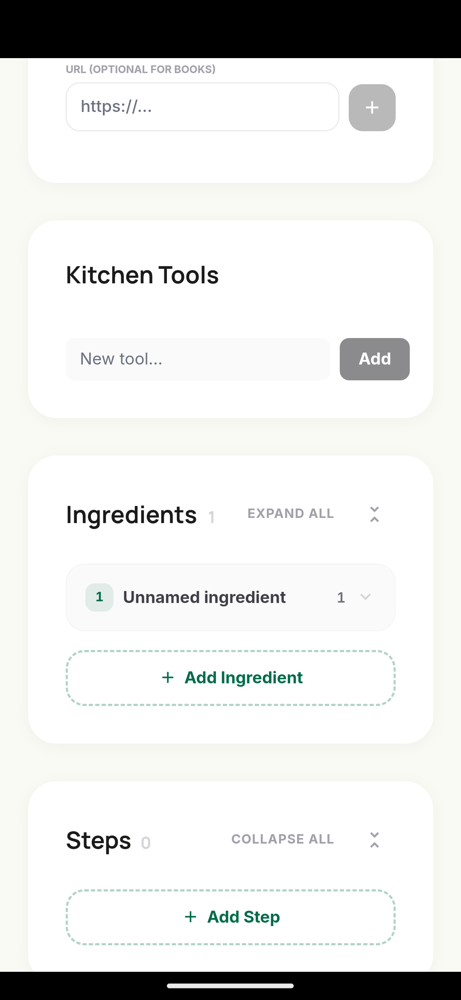
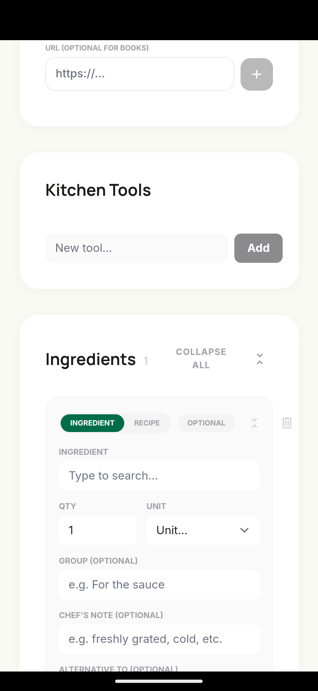
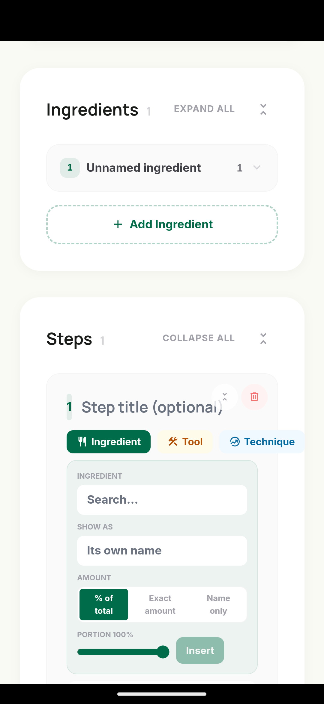

# 🍳 SmartChef Ecosystem

> **Offline-first, self-hosted recipe management** — nested recipes, dynamic portions, local AI import, multi-device sync, and a native Android app.

---

## 📋 Table of Contents

- [What it looks like](#-what-it-looks-like)
- [How to start the app](#-how-to-start-the-app)
  - [Option 1 — Docker (recommended)](#-option-1--docker-recommended)
  - [Option 2 — Local, without Docker](#-option-2--local-without-docker)
- [Checking it works](#-checking-it-works)
- [Admin Access](#-admin-access)
- [Common problems](#️-common-problems)
- [Project structure](#️-project-structure)
- [MCP Server](#-mcp-server)
- [API Routes](#-api-routes)
- [Matrioska Engine](#-matrioska-engine)
- [Bringing recipes in from elsewhere](#-bringing-recipes-in-from-elsewhere)
- [Pantry — what can I cook right now?](#-pantry--what-can-i-cook-right-now)
- [Sharing a recipe with someone who has no account](#-sharing-a-recipe-with-someone-who-has-no-account)
- [Multi-device sync](#-multi-device-sync)
- [Database migrations (server mode)](#️-database-migrations-server-mode)
- [Standalone Mode (Windows & Android, No Server)](#-standalone-mode-windows--android-no-server)
- [Mobile App (Android) & Remote Access via Tailscale](#-mobile-app-android--remote-access-via-tailscale)
- [Running Compose commands from any folder](#-running-compose-commands-from-any-folder)
- [Implementation status](#️-implementation-status)

---

## 📸 What it looks like

The desktop shots are the Windows build running against a real library; the
phone shots are the Android build on an emulator.

### The gallery

Every recipe, with its tags, times and difficulty. Filters, full-text search
and collections sit above it.



### A recipe

Hero image, the tags, and the times broken out — prep, waiting, cooking and
the total, because "1h" hides which part of it you have to be present for.
Below this sit the ingredients (scaled live by the servings slider, metric or
imperial), the method, and the origin map.



### The Atlas

Where your cooking comes from, counted by place. Pressing a pin — or the
"no region" counter — filters the library to it.



### Writing a recipe

Long recipes fold. Each ingredient and step card collapses to a one-line
summary, whole sections fold away, and "add another" is at the bottom of the
list where you already are.



An ingredient can be marked an **alternative to** another one, rather than a
further thing to buy — it is then listed under the ingredient it replaces and
left off the shopping list.



Step text points at the recipe's own ingredients, tools and techniques. A
reference prints the amount *that step* uses, and **Show as** re-labels it
with any of the ingredient's other names, so a step can read "sift the flour"
while still pointing at "Type 00 wheat flour".



---

## 🚀 How to start the app

### 🐳 Option 1 — Docker (recommended)

**Prerequisites:**
- [Docker Desktop](https://www.docker.com/products/docker-desktop/) installed and running (or Podman — see below)

```bash
# 1. Enter the project folder
cd smartchef

# 2. Copy the config file
cp docker/.env.example docker/.env

# 3. Start every service (DB + Backend + Frontend + Ollama)
cd docker
docker compose up -d

# 4. Check everything came up correctly
docker compose ps
```

After ~30 seconds, open in your browser:

| Service         | URL                          |
|-----------------|-------------------------------|
| **App (UI)**    | http://localhost:8888        |
| **Backend API** | http://localhost:3000/health |
| **MCP Server**  | http://localhost:3002/mcp    |
| **Ollama AI**   | http://localhost:11434       |

> The UI publishes **8888**, not the more obvious 8080. On Windows, WinNAT
> reserves TCP port ranges dynamically and had taken `7981-8080`, so nothing
> on the host — including WSL's port relay — could bind 8080 while the
> container inside the VM served happily. That combination reads exactly
> like a broken deploy. Check your own machine's reservations with
> `netsh interface ipv4 show excludedportrange protocol=tcp`, and change the
> port back in `docker/docker-compose.yml` if 8080 is free for you.

```bash
# 5. Pull the LLM model (first run only — a few GB)
docker exec smartchef_ollama ollama pull gemma3:4b
```

The model name must match `OLLAMA_MODEL` in `docker/docker-compose.yml` (defaults to `gemma3:4b`, chosen for good multilingual output on CPU-only inference — swap both if you'd rather use something else).

**To stop everything:**
```bash
docker compose down
```

**To stop everything and delete the data:**
```bash
docker compose down -v
```

**With Podman** (instead of Docker Desktop): the same commands work by swapping `docker` for `podman` — e.g. `podman compose up -d`, `podman compose ps`, `podman exec smartchef_ollama ollama pull gemma3:4b`.

---

### 💻 Option 2 — Local, without Docker

**Prerequisites:**
- [Node.js 20+](https://nodejs.org)
- [PostgreSQL 16](https://www.postgresql.org/download/) or via Homebrew: `brew install postgresql@16`
- [Ollama](https://ollama.com/download)

**1. Create the database:**
```bash
createdb smartchef
for f in db/migrations/*.sql; do psql smartchef < "$f"; done
```

**2. Start the Backend** (terminal 1):
```bash
cd backend
npm install

# Create the .env file
cp ../docker/.env.example .env
# Open .env and set:
#   DATABASE_URL=postgres://localhost:5432/smartchef
#   OLLAMA_URL=http://localhost:11434

npm run dev
# → Backend available at http://localhost:3000
```

**3. Start the Frontend** (terminal 2):
```bash
cd frontend
npm install
npm run dev
# → App available at http://localhost:5173
```

**4. Start Ollama** (terminal 3):
```bash
# Start the server
ollama serve

# In another terminal, pull the model
ollama pull gemma3:4b
```

---

## ✅ Checking it works

```bash
curl http://localhost:3000/health
```

Expected response:
```json
{
  "status": "ok",
  "db": true,
  "ollama": true,
  "ollamaModels": ["gemma3:4b"],
  "version": "1.1.0"
}
```

Then in the browser:
1. Go to **http://localhost:8888** (Docker) or **http://localhost:5173** (local)
2. On first run, set up the instance name/password, then log in
3. Click **Smart Import** in the sidebar
4. Paste the URL of any recipe (e.g. from giallozafferano.it), or switch to raw text
5. Click **Start AI Transformation** and wait for the LLM parse (CPU-only inference — can take a few minutes; a progress bar shows elapsed time)
6. Review the matched ingredients/steps, click **Create & Review Recipe**
7. Head back to the **Gallery** to see the imported recipe

---

## 🔐 Admin Access

This instance's first (admin) account:

| Username | Password |
|---|---|
| `admin` | `admin2026` |

> ⚠️ **Change this password** (Account → Save Changes) before sharing this repo
> or its history publicly — it's a weak, default-style password and this file
> is version-controlled. Additional users can be added by an admin from
> Account → Manage Users.

---

## ⚠️ Common problems

| Problem | Solution |
|---|---|
| Port 5432 already in use | `lsof -i :5432` and stop the local Postgres, or change the port in `docker/docker-compose.yml` |
| The UI port is already in use, or refuses connections | Change `"8888:80"` in `docker/docker-compose.yml` to any free port. If the container is running and healthy but the host still refuses the connection, check `netsh interface ipv4 show excludedportrange protocol=tcp` on Windows — WinNAT reserves ranges dynamically and nothing on the host can bind a port inside one |
| Ollama slow on first run | Normal — the model is a few GB, wait for the download to finish |
| Frontend can't reach the API | Locally, check that the proxy in `vite.config.ts` points at `http://localhost:3000` |
| `pg_trgm` error | Run: `psql smartchef -c "CREATE EXTENSION pg_trgm;"` |
| Ollama responds but parsing fails | Check the model is actually pulled: `ollama list` |
| `docker compose` not found | Update Docker Desktop to the latest version |
| 502 after rebuilding only the backend | nginx caches the old backend container IP — restart the frontend too: `podman restart smartchef_frontend` |

---

## 🏗️ Project structure

```
smartchef/
├── docker/
│   ├── docker-compose.yml              # PostgreSQL + Backend + Frontend + MCP + Ollama
│   └── .env.example                    # Environment variables (copy to docker/.env)
├── docker-compose.yml                  # Thin root-level entrypoint, includes docker/docker-compose.yml
├── db/
│   └── migrations/                     # Sequential SQL migrations — full schema history
├── shared/
│   └── types/index.ts                  # Shared TypeScript types (backend ⇄ frontend ⇄ MCP)
├── backend/
│   ├── src/
│   │   ├── db/pool.ts                  # PostgreSQL connection pool
│   │   ├── middleware/requireAuth.ts   # Session-cookie auth guard (mounted on all of /api except /api/auth)
│   │   ├── routes/
│   │   │   ├── recipes.ts              # Recipe CRUD, portion scaling, LLM parse, cook-sequence, nutrition
│   │   │   ├── ingredients.ts          # Ingredients, categories, tools, units
│   │   │   ├── techniques.ts           # Cooking techniques library
│   │   │   ├── tags.ts                 # Managed tag catalog + auto-tagging rules
│   │   │   ├── collections.ts          # Freeform recipe collections
│   │   │   ├── menus.ts                # Weekly meal planner
│   │   │   ├── shopping.ts             # Shopping list generation + Markdown export
│   │   │   ├── auth.ts                 # Login/setup, multi-user (admin-invited), LLM provider config (session JWT cookie)
│   │   │   ├── share.ts                # Export/import a recipe or collection as a portable file
│   │   │   ├── publicShare.ts          # Public share links: an authenticated owner half, plus the app's only unauthenticated router
│   │   │   ├── pantry.ts               # Pantry CRUD (per account)
│   │   │   ├── sync-folder.ts          # Multi-device sync via a shared folder + native offline snapshot pull
│   │   │   ├── backup.ts               # Manual whole-library backup export/import
│   │   │   ├── cook-log.ts             # Cook-history calendar (GET /cook-log?from=&to=)
│   │   │   ├── geocode.ts              # Nominatim proxy for free-text region geocoding
│   │   │   ├── sync.ts                 # Legacy CRDT/vector-clock P2P endpoints — see "Multi-device sync" below
│   │   │   └── uploads.ts              # Image uploads (multer + sharp)
│   │   ├── services/
│   │   │   ├── matrioska.engine.ts     # ⭐ Recursive portion scaling across nested sub-recipes (incl. weight/volume-based sub-recipe yield)
│   │   │   ├── llm.parser.ts           # Provider dispatch (Ollama/Anthropic/Gemini/OpenAI) — recipe extraction, translation, ingredient-name translation
│   │   │   ├── llm.providers.ts        # Anthropic/Gemini/OpenAI API clients
│   │   │   ├── crypto.service.ts       # AES-256-GCM encrypt/decrypt for stored LLM API keys
│   │   │   ├── ingredient.matcher.ts   # Fuzzy match LLM output → DB (Levenshtein), auto-creates missing ones
│   │   │   ├── tags.service.ts         # Ingredient-driven auto-tagging
│   │   │   ├── nutrition.service.ts    # Per-serving nutrition calculation
│   │   │   ├── pantry.service.ts       # Pantry rows + "what can I cook?" matching
│   │   │   ├── folder-sync.service.ts  # Whole-library snapshot export/merge (multi-device sync + backups)
│   │   │   ├── device-identity.service.ts
│   │   │   └── crdt/vector-clock.ts    # Legacy — not wired into any write path, kept for the old sync.ts routes
│   │   └── index.ts                    # Express entry point
│   └── Dockerfile
├── mcp/
│   ├── src/
│   │   ├── backendClient.ts            # HTTP client against the backend REST API
│   │   ├── tools.ts                    # MCP tool definitions
│   │   └── index.ts                    # Entry point (Express + Streamable HTTP transport)
│   └── Dockerfile
└── frontend/
    ├── src/
    │   ├── pages/
    │   │   ├── Home.tsx                 # Gallery: search/filters, sort, adjustable grid density, Collections tab
    │   │   ├── RecipeCreate.tsx         # New recipe editor
    │   │   ├── RecipeDetail.tsx         # View/edit + Matrioska portion calculator + kitchen mode
    │   │   ├── RecipeImport.tsx         # AI import wizard (URL / raw text / portable-file import)
    │   │   ├── LibraryIngredients.tsx   # Ingredients + categories + translations
    │   │   ├── LibraryTools.tsx / LibraryUnits.tsx / LibraryTechniques.tsx / LibraryTags.tsx
    │   │   ├── Planner.tsx              # Weekly meal planner (drag-and-drop, @dnd-kit)
    │   │   ├── Pantry.tsx               # What's in the house + "what can I cook right now?"
    │   │   ├── Atlas.tsx                # Recipes on a world map, by region
    │   │   ├── ShoppingList.tsx         # Shopping list
    │   │   ├── CollectionDetail.tsx     # Recipe collection view
    │   │   ├── CookHistory.tsx          # Cook-history month calendar
    │   │   ├── Login.tsx / Account.tsx  # Auth + account settings (avatar presets, LLM provider), Backup & Restore, Multi-Device Sync
    │   │   ├── ManageUsers.tsx          # Admin-only: invite/list/remove instance users
    │   │   └── ServerConnect.tsx        # Native-app-only: connect to a remote SmartChef server
    │   ├── lib/unitConvert.ts            # Display-only unit/temperature/tin-size conversion — never written back
    │   ├── lib/cookTimers.ts             # Step timers, module-level so leaving cook mode doesn't cancel the roast
    │   ├── lib/zipReader.ts              # Minimal zip/gzip reader for migration archives (DecompressionStream)
    │   ├── hooks/useWakeLock.ts          # Keeps the screen awake in cook mode, re-acquired on visibilitychange
    │   ├── services/recipeStructuredData.ts  # schema.org JSON-LD / microdata recipe extraction, tried before any LLM
    │   ├── services/pageFetcher.ts       # Fetches a page's HTML via the backend or the native bridge
    │   ├── services/migration/           # Paprika/Mealie/Crouton/Mela/Nextcloud/CopyMeThat importers, PDF text and on-device OCR
    │   ├── services/pantry.local.ts      # Standalone pantry + filter-by-pantry
    │   ├── components/Modal.tsx          # Shared dialog shell — pinned header/footer, one scrolling body, Escape stack, scroll lock
    │   ├── components/Form.tsx           # Field/section/translation-row primitives the dialogs are built from
    │   ├── fonts/                        # Generated Material Symbols subset (see scripts/subset-material-symbols.py)
    │   ├── lib/api.ts                   # apiFetch — same-origin on web, absolute+cookie'd on native, offline fallback/outbox, routes to standalone mode's local router when active
    │   ├── lib/offlineStore.ts          # Native SQLite cache + write outbox (server-mode Android's offline read cache)
    │   ├── lib/countries.ts             # Country code → centroid lat/lng for the region map
    │   ├── lib/standalone.ts            # Standalone-mode profile (display name, no password) + first-run init
    │   ├── lib/electronBridge.ts        # Renderer-side helpers for Electron's IPC bridge (folder picker, fs primitives)
    │   ├── lib/gitfs.ts                 # isomorphic-git fs adapter — @capacitor/filesystem on Android, IPC-to-main-process on Electron
    │   ├── lib/sync/gitSync.ts          # Folder Sync engine: git commit/pull + LWW merge for standalone mode
    │   ├── db/local.ts                  # Local SQLite datastore (standalone mode) — same query/queryOne/withTransaction shape as backend/src/db/pool.ts
    │   ├── services/*.local.ts          # Standalone-mode ports of the backend routes (recipes, ingredients/units/tools, backup import) — called directly, no HTTP layer
    │   ├── services/localRouter.ts      # Dispatches apiFetch calls to the *.local.ts services when standalone mode is active
    │   ├── components/AppLayout.tsx     # Shared header + sidebar navigation
    │   ├── components/RegionPicker.tsx   # Recipe geolocation chip picker
    │   ├── components/RegionsMap.tsx / AtlasMap.tsx  # Lazy shells; the Leaflet map and its 739 KB of country boundaries live in the *View.tsx files behind them
    │   └── store/app.store.ts           # Global state (Zustand)
    ├── scripts/subset-material-symbols.py  # Cuts the 3.9 MB icon font down to the ~350 icons the app names (run by `prebuild`)
    ├── android/                         # Capacitor Android project (native wrapper, see below)
    ├── electron/                        # Capacitor Electron project — the Windows desktop app (standalone mode section below)
    ├── nginx.conf                       # SPA routing + API proxy
    └── vite.config.ts
```

---

## 🔌 MCP Server

A separate service (its own `package.json`, Dockerfile, and container — it doesn't run inside the backend process) exposes the recipe library via [Model Context Protocol](https://modelcontextprotocol.io), so an AI assistant can read and create recipes directly.

- Endpoint: `POST http://localhost:3002/mcp` (Streamable HTTP transport, stateless — each request opens its own MCP session)
- Doesn't touch the database directly: it calls the backend's own REST routes (`BACKEND_URL`, defaulting to `http://backend:3000` inside Docker)

Exposed tools:

| Tool | Description |
|------|-------------|
| `list_recipes` | Search/filter recipes (query, tag, difficulty, components) |
| `get_recipe` | Full detail of a recipe (ingredients, steps, tools, techniques) |
| `scale_recipe_portions` | Matrioska engine: recalculates quantities for N portions, resolving nested sub-recipes |
| `create_recipe` | Creates a new recipe with ingredients (incl. groups), steps (incl. tagged techniques), tools, storage instructions and tips |
| `update_recipe` | Updates an existing recipe's fields |
| `delete_recipe` | Deletes a recipe |
| `list_ingredients` / `list_ingredient_categories` | Browse the pantry |
| `list_units` | Units of measure and conversion factors |
| `list_tools` | Kitchen tools |
| `list_techniques` | Cooking techniques library |

To connect it to an MCP client (e.g. Claude Desktop) that requires a stdio transport, use a proxy like [`mcp-remote`](https://www.npmjs.com/package/mcp-remote) pointed at `http://localhost:3002/mcp`.

---

## 📡 API Routes

All routes below live under `/api` and (aside from `/api/auth/*`) require an authenticated session cookie. This is a resource-level overview, not an exhaustive endpoint list — see `backend/src/routes/*.ts` for the full set.

| Base path | Covers |
|-----------|--------|
| `/api/auth` | First-run setup, username/password login, logout, account settings (incl. LLM provider config), admin-only user management (`/users`) |
| `/api/recipes` | CRUD, `?q=&tag=&tags=&ingredientCategories=&regions=&difficulty=&sort=&seasonalOnly=&seasonalMonth=`, `/:id/portions?servings=N` (Matrioska), `/:id/cook-sequence`, `/:id/nutrition`, `/:id/rating`, `/:id/cooked`, `/:id/translate/:lang` (AI translation), `/:id/collections`, `/parse` (AI import), `/filter-by-pantry` (which recipes the pantry can cover, resolved through nested sub-recipes) |
| `/api/ingredients` | Ingredients (incl. `seasonalMonths`), `/categories`, nested `/api/units`, `/api/tools` |
| `/api/techniques` | Cooking techniques library |
| `/api/tags` | Managed tag catalog |
| `/api/collections` | Freeform recipe collections |
| `/api/menus` | Weekly meal planner |
| `/api/shopping` | Shopping list generation, item check-off, Markdown export |
| `/api/pantry` | What's in the cupboard: list, upsert by ingredient, remove |
| `/api/share` | Export/import a recipe, bulk recipes, or a collection as a portable `.smartchef.json` file; `/links/:recipeId` creates, reads and revokes a public share link |
| `/api/public` | **The only unauthenticated read path.** `/recipes/:token` returns an allowlisted projection of one shared recipe; `/r/:token` is a server-rendered HTML page, so a link pasted into a chat gets a real preview |
| `/api/sync-folder` | Multi-device sync status/trigger + native app's offline-cache snapshot pull |
| `/api/backup` | Manual whole-library backup export/import |
| `/api/cook-log` | Cook-history calendar (`GET ?from=&to=`), backing the "I cooked this" log |
| `/api/geocode` | Server-side Nominatim proxy for free-text region geocoding (cached) |
| `/api/sync` | Legacy CRDT/vector-clock P2P endpoints — see [Multi-device sync](#-multi-device-sync) |
| `/api/uploads` | Image uploads |
| `/health` | DB + Ollama status (no auth required) |

---

## 🧩 Matrioska Engine

Recipes can be nested infinitely. The engine recursively resolves every sub-recipe and aggregates ingredients scaled to the requested number of portions:

```
Gala Dinner (×10 people)
├── 500g   Egg pasta              ← plain ingredient  (×10/4 = ×2.5)
├── 3 srv  Mother Sauce           ← nested sub-recipe
│   ├── 1500g  Tomatoes           ← resolved: 500g × 3
│   └── 150ml  Olive oil          ← resolved: 50ml × 3
└── to taste  Salt                ← vague quantity → warning
```

```bash
GET /api/recipes/:id/portions?servings=10
```

---

## 📥 Bringing recipes in from elsewhere

The Import screen has four ways in, and they are tried in order of how much
they can be trusted.

**A URL.** Most recipe sites publish their recipe as schema.org JSON-LD or
microdata, which is the actual structured data behind the page — exact
quantities, units, yields and ISO-8601 times. SmartChef reads that first and
only falls back to the LLM when a page has neither. That is not a small
difference: the LLM path truncates the page to fit a context window and
spends minutes of CPU inference, where the structured path is a parse.

**A file exported from another app.** Paprika (`.paprikarecipes`), Mealie,
Crouton, Mela, Nextcloud Cookbook and CopyMeThat, plus bare schema.org JSON.
Zip and gzip archives are unpacked in the browser. Imports go through the
same fuzzy ingredient matcher the AI path uses, so "400g San Marzano
tomatoes" resolves to the tomato already in your library rather than minting
a duplicate.

**A PDF.** Text is extracted directly when the file has a text layer.

**A photo.** OCR runs on your own device via Tesseract — no image is
uploaded anywhere. The language model for a language is downloaded once
(~12 MB) and cached, so the first photo needs a connection and none after it
do. Printed pages photographed straight-on read well; handwriting is
genuinely hit and miss, which is why extracted text lands in the review box
rather than importing straight off.

---

## 🥫 Pantry — what can I cook right now?

Record what's in the house (Pantry tab), then ask what it lets you cook.

An entry with no quantity means "I have some" and satisfies any amount —
being made to weigh the flour before the app will accept it is exactly the
friction that stops anyone keeping a pantry current. Optional ingredients
never count against a recipe, and an amount that can't be compared (a pinch,
a different kind of unit) is assumed to be fine rather than hiding the
recipe.

The match resolves **through the Matrioska engine**, so a dish whose sauce is
itself a recipe is judged on the sauce's ingredients too — the one thing
none of the comparable apps can do, since none of them have nested recipes.
Loosen the filter to see near-misses and what's short.

---

## 🔗 Sharing a recipe with someone who has no account

Server mode only, and deliberately: a public URL needs a server that is
running and reachable, which is the one thing standalone mode is defined by
not having. The offline builds say so and offer the file export instead.

From a recipe page, **Share → Create public link** mints a token and gives
you a URL. Opening it needs no account. What the visitor gets is an
allowlist built field by field — not the internal recipe minus a few keys,
which silently publishes every column added later. Creator, ratings and cook
log are not included, and internal step references are stripped rather than
leaking ids.

The token is the credential, so it is 32 bytes of crypto-quality randomness
and never derived from the recipe id — a guessable token would make every
recipe public at once. Links can carry an expiry or run until revoked, and
revoking deletes the link rather than touching the recipe.

`/api/public/r/:token` is a real server-rendered HTML page rather than JSON,
because a link pasted into a chat gets previewed by fetching it as a
document: JSON yields no title, image or description.

---

## 🔄 Multi-device sync

Two independent mechanisms exist — worth being precise about which one actually does what:

**Folder-based sync (the one that works).** Each device writes a full-library snapshot (`smartchef-<deviceId>.json`) into a shared folder — a plain local folder, or one kept in sync by a desktop client like OneDrive/Google Drive. On every cycle, a device reads every *other* device's file and merges each row in by id, last-write-wins on `updated_at`. No central server, no pairing handshake. Enable it with `SYNC_ENABLED=true` + `SYNC_FOLDER_HOST_PATH` in `docker/.env`; status, peer list, and a manual "Sync Now" (with a per-entity change summary) are on the **Account** page. The same snapshot format also powers the **Backup & Restore** feature (manual export/import, independent of sync being enabled) and the native app's offline read cache.

*This is the server-mode mechanism, backed by the Docker/Postgres backend.* **Standalone mode** (no server at all — see [below](#-standalone-mode--windows--android-no-server)) has its own, separate Folder Sync built on real git commit history (`frontend/src/lib/sync/gitSync.ts`, via `isomorphic-git`) instead of snapshot files — same LWW-by-`updated_at` idea, different implementation, since there's no backend process to run the sync loop.

**CRDT vector-clock P2P (`/api/sync/*`, legacy).** An earlier, more ambitious design — direct device-to-device sync with field-level conflict detection via vector clocks (`services/crdt/vector-clock.ts`, `mdns.service.ts`). The endpoints exist and respond, but no mutating route in the app ever logs a local edit into the operation log, so there's nothing real for peers to exchange — it predates and was superseded by folder-based sync. Kept in the codebase but not used by the UI; retrofitting true per-operation CRDT logging into every write path would be a large separate undertaking.

**Native app offline editing.** Separate again from both of the above: the Android app keeps a local SQLite cache of the whole library and a write outbox for edits made without connectivity, replayed against the real API on reconnect — see `frontend/src/lib/api.ts`, `offlineStore.ts`, `offlineSync.ts`.

---

## 📴 Standalone Mode (Windows & Android, No Server)

Everything above assumes a running Docker/Postgres backend. SmartChef also runs **fully offline, with no server at all**: the Windows desktop app and the Android app can each keep their own local SQLite database, work indefinitely with zero connectivity, and — if you want more than one device — converge with each other through a shared folder using real git history instead of a central server.

### Building the apps

Both are built from the same `frontend/` React codebase via [Capacitor](https://capacitorjs.com); there's no hosted download, so build (or re-build) them yourself:

> **Build prerequisite:** `npm run build` regenerates the Material Symbols
> icon subset first (`prebuild` → `scripts/subset-material-symbols.py`),
> which needs Python with `fonttools` installed. Without them the build
> prints a warning and uses the committed `frontend/src/fonts/` copy, which
> is correct for the icons in the repo today — you only need Python if you
> have added new icon names to the source.

**Windows** (`frontend/electron/`, an Electron wrapper):
```bash
cd frontend
npm install
npm run electron:build
```
Produces an NSIS installer at `frontend/electron/dist/SmartChef Setup 1.1.0.exe`.

**Android**:
```bash
cd frontend
npx cap sync android
cd android
./gradlew assembleDebug
```
Produces `frontend/android/app/build/outputs/apk/debug/app-debug.apk` — install via `adb install app-debug.apk`, or transfer the file to the phone and open it directly (requires allowing "install from unknown sources").

> On Windows, `gradlew` reads `JAVA_HOME` before it ever gets to the JDK pinned in
> `android/gradle.properties`, so an inherited `JAVA_HOME` pointing at a JDK that
> isn't there any more aborts the build with a path nobody configured. Override it
> for the one command:
> `JAVA_HOME="C:\Program Files\Microsoft\jdk-21.0.12.101-hotspot" ./gradlew assembleDebug`

To try it on an emulator rather than a handset:

```bash
emulator -list-avds                     # pick one, or make one in Android Studio
emulator -avd <name> -no-snapshot-load &
adb wait-for-device
adb install -r frontend/android/app/build/outputs/apk/debug/app-debug.apk
adb shell am start -n com.smartchef.app/.MainActivity
```

### Publishing on F-Droid

The app is a good F-Droid candidate as-is: MIT licensed, no Google Play Services,
no `google-services.json`, no proprietary libraries, and the whole thing builds
from this repo. There are two routes, and they cost very different amounts of
work.

#### What has to change first, either way

1. **Release signing.** The APK above is a *debug* build signed with the shared
   Android debug keystore. Android identifies an app by its signing key, so the
   key you publish with is a one-way decision — an app signed with a different key
   later cannot update the installed one. Generate a keystore, keep it backed up,
   and add a `signingConfigs`/`release` block to `frontend/android/app/build.gradle`
   (F-Droid's own repo does not need this — it signs with *its* key — but your own
   repo does).
2. **Bump `versionCode` on every release.** It is the only number Android compares
   when deciding whether something is an upgrade; `versionName` is for humans.

#### Route A — your own F-Droid repository (an afternoon)

Full control, no review queue, and users add one URL. This is the pragmatic
option for a self-hosted app with a handful of users.

```bash
pipx install fdroidserver          # or: apt install fdroidserver
mkdir -p fdroid-repo && cd fdroid-repo
fdroid init                        # creates config.yml + the repo signing key
cp ../frontend/android/app/build/outputs/apk/release/app-release.apk repo/
fdroid update -c                   # builds the index, reads metadata out of the APK
```

(`fdroid-repo/`, not `fdroid/` — the latter holds the submission files for
Route B below.)

Serve the resulting `fdroid-repo/repo/` directory over HTTPS — GitHub Pages is
enough. Users then add `https://<user>.github.io/smartchef/fdroid-repo/repo`
under **F-Droid → Settings → Repositories**. Keep `fdroid-repo/keystore.p12`
and `config.yml` out of git; losing the repo key means every user has to
remove and re-add the repository.

#### Route B — the official f-droid.org repository (weeks, mostly waiting)

Widest reach, and F-Droid builds the APK itself on its own build server and
signs it with its own key, so nothing of yours is trusted beyond the source.
You open a merge request against
[`fdroid/fdroiddata`](https://gitlab.com/fdroid/fdroiddata) adding
`metadata/com.smartchef.app.yml`.

**That submission is already prepared in this repo** — see
[`fdroid/README.md`](fdroid/README.md). It has the finished build recipe
(`fdroid/metadata/com.smartchef.app.yml`), a checklist of every requirement in
F-Droid's quick-start guide against what this repo already satisfies, and the
exact `git`/`fdroid` commands for the fork and the merge request. The app's
own store listing — descriptions, changelog, icon and screenshots, in English
and Italian — lives in [`fastlane/metadata/android/`](fastlane/metadata/android/),
which is where F-Droid reads it from.

The awkward part, documented there in full: the APK is a Capacitor shell
around a Vite build, so **Node has to run before Gradle does** and F-Droid's
build server has no Node by default. It goes in `sudo:` and `build:` — not
`prebuild:`, because the source scanner runs between the two and `npm ci`
would drop a `node_modules` full of binaries into its path.


### Something to look at on first run

A fresh install opens on an empty gallery. [`samples/`](samples/) holds a real
exported library — 46 recipes, 239 ingredients, the tag and technique
catalogues — that loads through **Account → Backup & Restore → Restore from
Backup**. [`samples/README.md`](samples/README.md) explains exactly what
restoring does to a library you already have: it merges by id, never deletes,
and is safe to run twice.

### First run: standalone vs. server

On first launch, both apps ask **"Connect to a server"** (the Tailscale setup described below) or **"Use offline on this device."** Choosing offline asks for a display name and an optional avatar — no password, since each device's local data is already private to whoever holds the device.

### Household Profiles — more than one person sharing a standalone library

Standalone mode isn't limited to one name per device. **Profiles** (who's currently using the app — for labeling recipes you create and cooks you log) are their own synced entity, distinct from **Local Storage** and the **Sync Folder** below: a profile created on one device becomes pickable on every other device sharing the same Sync Folder, the same way a recipe or ingredient does.

- **Creating the first profile**: the "Use offline on this device" screen asks for a name (+ optional avatar) and creates the first profile — same as any first-run today.
- **Joining an existing household**: if you point a *new* device at a Sync Folder that already has profiles synced into it (choose the folder before finishing setup), the app syncs once and offers **"pick who you are"** instead of forcing a redundant new profile — pick an existing one, or still create a new one if this is genuinely a new person.
- **Switching who's using a shared device**: Account → **Switch Profile** brings back the "Who's cooking?" picker without touching the local library, the Sync Folder, or any other profile — distinct from **Log Out**, which forgets this device's standalone setup entirely.

### Getting your existing recipes into a fresh standalone install

If you already run the server-mode Docker stack with a real library built up, you don't have to re-create it by hand on a new standalone device:

1. On the **server-mode** instance (the one with your data, e.g. `http://localhost:8888`), go to **Account → Backup & Restore → Export Backup**. This downloads one JSON file containing your whole library — recipes, ingredients, tools, tags, ingredient categories, and cooking techniques, with all translations.
2. On the **new standalone device** (Windows or Android), finish the offline first-run setup, then go to **Account → Backup & Restore → Restore from Backup** and pick that same JSON file.

Restoring is additive, not destructive, and safe to run more than once: every item is matched by its original id, so anything already present locally is left untouched rather than duplicated or overwritten — importing the same backup twice, or two backups that partially overlap, is a harmless no-op for whatever's already there.

Standalone mode's own **Export Backup** button is intentionally not available — Folder Sync (below) is standalone's real, continuous backup mechanism instead of a one-shot file, and it also gives you full history. Restore still works normally in standalone mode either way, specifically for pulling data in from an existing server-mode library like this.

### Folder Sync — converging multiple standalone devices

Standalone devices never talk to each other directly, and never require both to be online at once. Local Storage — the live SQLite database + images every screen actually reads and writes — is always a fixed, per-platform location (`Documents/SmartChef` on Windows; a private app-data folder on Android), not something you pick. How devices actually exchange changes is a choice, set per device in Account → Folder Sync (or noted during first-run setup): **Folder mode** (the original design) or **Git Remote mode**.

**Folder mode** points at a *separate* location — a plain local folder, a mapped network drive/SMB share, or a folder already kept in sync by [Syncthing](https://syncthing.net), OneDrive, Google Drive, or Dropbox's desktop client. On Android this is the system's folder picker (Storage Access Framework) instead, which can point at the same kinds of targets via whichever apps expose a folder handle to it — Syncthing is the most reliable option here, since the mainstream cloud-storage Android apps don't genuinely keep an arbitrary folder two-way synced the way their desktop clients do.

Under the hood, a Folder-mode Sync Folder is a **bare-style git remote** — it only ever holds git objects and refs, never a checked-out working tree. Each device keeps its own private **Hidden Clone** (a real git repository, invisible in the UI, distinct from both Local Storage and the Sync Folder) where every local change gets committed. Syncing pulls the Hidden Clone against the Sync Folder over a hand-rolled object/ref transport (isomorphic-git's own fetch/push only speak HTTP, and a Sync Folder is just files on disk) before ever pushing — never the other way around, so a device can't overwrite the shared ref before it's looked at what's actually there — then pushes with a compare-and-swap check so a concurrent write from another device is detected and retried, not silently clobbered. Object transfers run several at a time (not strictly one-by-one) to keep sync fast even against a transport with real per-call overhead, like Android's Storage Access Framework — and if a device's own folder listing ever looks incomplete (the Google Drive/Android case above), it automatically falls back to downloading a single git-bundle-format snapshot instead of enumerating objects one by one, rather than merging against a silently partial view.

**Git Remote mode** points at a real git server instead — GitHub, GitLab, or self-hosted — reached over git's actual push/fetch protocol (Account → Folder Sync → Git Remote: repository URL, optional username, an access token). Unlike most git-in-the-browser tools, this doesn't need a CORS proxy for GitHub/GitLab — the request runs through native code (Electron's main process, or a small Android plugin), which was never subject to the browser's CORS policy in the first place, the same trick this app already uses for filesystem access. No file-sync tool is in the loop at all in this mode either way: the server owns atomic ref updates natively and always knows its own true object set, so the failure modes above (ref races, incomplete listings) don't apply. See [ADR 0004](./docs/adr/0004-git-remote-sync-mode.md) for the full story, including the public CORS-proxy dead end this replaced.

Both modes run **Structured Merge** — a field-by-field three-way merge, not git's textual merge — to reconcile whatever changed on both sides since they last agreed. A field genuinely edited on both devices becomes a **Conflict**, surfaced in its own list (Account → Folder Sync) for you to resolve rather than silently auto-picked; everything else about that sync still finishes normally. Covers recipes (steps, ingredients, ingredient groups, tagged techniques included), ingredients, tools, tags, cooking techniques, and household profiles — deletions propagate as tombstones the same way any other edit does. Device-record tracking ("Known Devices") is Folder-mode-only for now; Git Remote mode doesn't show it.

Once two devices are pointed at the same Sync Folder or git remote — however it got that way — Account → **Sync Now** pushes local changes and pulls in whatever changed elsewhere; a recipe created on one device shows up on the other the next time both sync. How often that happens automatically (besides on app resume and a manual Sync Now) is also configurable there, per device — a value plus a unit (minutes/hours/days/weeks/months, e.g. "every 3 days"), not just minutes. The full commit history is browsable on either device at Account → Folder Sync → **History**. See [`CONTEXT.md`](./CONTEXT.md) for the full glossary of these terms and [`docs/adr/`](./docs/adr/) for the architecture decisions behind them.

---

## 📱 Mobile App (Android) & Remote Access via Tailscale

SmartChef is already an installable PWA, but for a native Android app with a real offline cache, a [Capacitor](https://capacitorjs.com) wrapper (`frontend/android/`) was added, reusing the entire existing React frontend. For it to work — both at home and away — the backend needs a reachable HTTPS address, provided by [Tailscale](https://tailscale.com) instead of a traditional reverse proxy/public domain: no router ports to open, one stable address that's identical on LAN and remote.

### 1. Install Tailscale on both devices

- **On the PC acting as server:** `winget install Tailscale.Tailscale`, then `tailscale up` (opens a login URL to complete in the browser).
- **On the phone:** install the Tailscale app from the Play Store, sign in with the same account.
- **Enable HTTPS certificates** (one-time, per tailnet) in the admin console: <https://login.tailscale.com/admin/dns> → "HTTPS Certificates" section → Enable.

### 2. Expose the app over HTTPS

```bash
tailscale serve --bg --https=443 http://127.0.0.1:8888
```

Makes the app reachable at `https://<machine-name>.<your-tailnet>.ts.net` with a real certificate (Let's Encrypt, auto-renewed by Tailscale) — no need to configure Caddy/nginx for certs. Verify with `tailscale serve status` and `tailscale status` (shows the exact machine name and whether the phone is already connected to the same tailnet).

### 3. Configure session cookies and CORS

The native app runs on a fixed origin (`https://localhost`, Capacitor's default `androidScheme`) different from the backend's — unlike a regular browser, which goes through the same domain via the frontend's nginx proxy. This needs explicit config in `docker/.env` (copy from `docker/.env.example`):

```bash
COOKIE_SAME_SITE=none
COOKIE_SECURE=true
CORS_ORIGIN=https://<machine-name>.<your-tailnet>.ts.net,https://localhost
```

`CORS_ORIGIN` accepts a comma-separated list — it must include **both** the Tailscale address (for browser access) **and** `https://localhost` (the Android WebView's fixed origin, independent of which server the app is configured to talk to). Then:

```bash
podman compose up -d --build backend
podman restart smartchef_frontend   # otherwise nginx keeps caching the backend's old IP
```

### 4. Build the Android app

```bash
cd frontend
npm install
npx cap sync android
cd android
./gradlew assembleDebug
```

The debug APK is generated at `frontend/android/app/build/outputs/apk/debug/app-debug.apk`. Install it on the phone (via `adb install app-debug.apk`, or transfer the file and open it directly — requires allowing "install from unknown sources").

### 5. Connect the app to the server

On first launch the app shows a "Connect to your SmartChef server" screen — enter the Tailscale address (`https://<machine-name>.<your-tailnet>.ts.net`). The app checks `/health` before saving the address; if that check fails, confirm Tailscale is connected on the phone and steps 2–3 above are complete.

### Offline mode

Once logged in, the phone keeps a local cache (SQLite) of the whole library (recipes, ingredients, tags, tools, collections) and a queue of changes made without connectivity (creating/editing recipes and ingredients, ratings, deletions, logging a cook), automatically replayed against the backend as soon as the connection returns.

---

## 🐳 Running Compose commands from any folder

Besides `docker/docker-compose.yml` (the real services), an equivalent file sits at the project root (`./docker-compose.yml`) that includes it via the `include:` directive, so commands work without `cd docker` first:

```bash
podman compose -f docker-compose.yml up --build --force-recreate
```

Both files explicitly point at the same Compose project (`name: docker` at the top of each) — necessary because otherwise the default project name is derived from whichever folder the command is run from, and the two folders would resolve to two completely separate stacks (and two separate sets of data volumes).

---

## 🗺️ Implementation status

| Area | Description | Status |
|------|-------------|--------|
| Docker + DB schema + Matrioska Engine | Recursive portion scaling, nested sub-recipes | ✅ Complete |
| Gallery — search, filters, sort, density | Search across title/description/ingredients, tag + ingredient-category filters, sort (recent/newest/oldest/A-Z), adjustable 2/3/4-column grid | ✅ Complete |
| Recipe editor | Ingredients (with optional sub-groups), steps (taggable with techniques), tools, storage instructions & tips, inline step↔ingredient references ("Bimby-style", live-scaled quantities), translations, ratings, ingredient substitutes, cook counter, delete. Both long lists fold: each ingredient/step card collapses to a one-line summary, the whole section folds, and "add another" sits at the bottom of the list rather than in the header. Every long-text box grows with its content (`AutoTextarea`) — measured in JS, because the one-line CSS answer (`field-sizing: content`) is inert in the Electron build's Chromium 114 and on older Android WebViews, which is the one place it was needed | ✅ Complete |
| Dialog focus on old WebViews | Dialogs animate in from `opacity: 0`, and focusing the first field on that frame is accepted by Chromium 114 (what Electron 25 ships) without key events ever reaching it — the dialog looked focused and silently refused to type until something forced a focus re-commit, such as alt-tabbing away or taking a screenshot. `Modal` now waits for the entry animation to finish (`getAnimations()`, with a timeout fallback for `prefers-reduced-motion`) before focusing anything | ✅ Complete |
| Inline step references | `{{ing:N}}` / `{{tool:id}}` / `{{tech:id}}` tokens expanded in the step text (`frontend/src/lib/stepRefs.ts`). A reference prints the amount **that step** uses — 500 g of the 620 g of flour, not the recipe's total — and `as=` re-labels it with any of the entity's synonyms, so a sentence can read "setaccia la farina" while still pointing at "Farina di grano tipo 00". `q=` with an empty value prints the name alone. The picker offers only what is still unspoken for at that step (with one click to see the rest) and shows what is left rather than the recipe total. The editor keeps the token's amount in step with the step's own ingredient row, and re-numbers every reference when an ingredient is deleted | ✅ Complete |
| Ingredient substitutes | An ingredient row can be marked as an **alternative to** another one ("or 100 g of margarine") rather than a further thing the recipe needs: shown indented under the ingredient it replaces, and dropped from everything built on the matrioska engine — the shopping list, the nutrition totals and the pantry matcher — so an either/or is never bought, counted or demanded twice | ✅ Complete |
| Scaling warnings | Flags when a requested portion count scales a recipe more than 3x up or down from its original yield, since ingredient ratios/cook times stop being reliable past that range | ✅ Complete |
| Library (Ingredients/Tools/Units/Techniques/Tags) | Full CRUD + translation editors; managed tag catalog with ingredient-driven auto-tagging | ✅ Complete |
| Nutrition | Per-serving calculation from ingredient nutrition data, resolved through nested sub-recipes | ✅ Complete |
| Collections & Meal Planner & Shopping List | Freeform recipe collections; weekly planner; shopping list from a saved menu or an ad-hoc cart, aggregated or grouped view, Markdown export | ✅ Complete |
| AI recipe import | Real Ollama-backed parsing (URL/raw text) with fuzzy ingredient/tool matching, source-language detection, progress feedback, fills every recipe field (ingredient groups, step techniques, storage instructions, tips included); portable-file import/export for sharing between instances | ✅ Complete |
| Structured-data URL import | schema.org JSON-LD and microdata parsed before the LLM is ever called — exact quantities, units, yields and ISO-8601 times instead of a page truncated to fit a context window. Falls back to the LLM only when a page publishes neither | ✅ Complete |
| Migration importers | Paprika (`.paprikarecipes`), Mealie, Crouton, Mela, Nextcloud Cookbook, CopyMeThat and bare schema.org JSON; zip/gzip unpacked in the browser via `DecompressionStream`. Imports run through the existing fuzzy matcher rather than trusting foreign ids, so they can't mint duplicate ingredients | ✅ Complete |
| PDF & photo/OCR import | Text extracted directly from a PDF's text layer; photos read on-device with Tesseract (nothing uploaded — the language model downloads once, ~12 MB, then works offline). Extracted text lands in the review box rather than importing straight off | ✅ Complete |
| Cook mode, timers & wake lock | Full-screen kitchen mode, including a variant that interleaves a sub-recipe's steps with the main recipe's; each step's ingredients as a tickable checklist showing the amount that step takes and how much of it is left afterwards; step timers held in a module-level store so leaving the screen doesn't cancel the roast; screen kept awake, re-acquired after the app is backgrounded | ✅ Complete |
| Unit / temperature / tin-size converter | Metric ⇄ imperial, affine temperature, area-based tin scaling. Display-only and never written back, so a converted view can't corrupt the recipe | ✅ Complete |
| Pantry & "what can I cook?" | Per-account pantry; matching resolves through nested sub-recipes, so a dish whose sauce is itself a recipe is judged on the sauce's ingredients too. A quantity-less entry means "I have some", optional ingredients never count against a recipe, and an incomparable amount is assumed fine rather than hiding the recipe | ✅ Complete |
| Public share links | Server mode only. A revocable, optionally-expiring token (32 random bytes, never derived from the recipe id) exposes one recipe through an allowlisted projection, plus a server-rendered HTML page so a pasted link previews properly in a chat | ✅ Complete |
| Drag-and-drop planner | Week grid on `@dnd-kit`; the dead, deprecated `react-beautiful-dnd` dependency was removed rather than replaced with its fork | ✅ Complete |
| Auth | Username/password login, admin-invited multi-user accounts (recipes stay a shared household cookbook — accounts drive attribution + private shopping list/planner/collections, not access control), session JWT cookie | ✅ Complete |
| Cloud LLM providers | Optional Anthropic/Gemini/OpenAI for recipe-import parsing and AI translation, per-instance encrypted API keys (Account page); local Ollama stays the default | ✅ Complete |
| AI recipe translation | One-click translate a recipe's title/description/steps/ingredient notes into another language via whichever LLM provider is configured | ✅ Complete |
| Cook-history calendar | Month-view log of "I cooked this" events per recipe, linked from the recipe page | ✅ Complete |
| Recipe geolocation | Chip-based region picker that searches **real places**, not just the ~195 countries: type three letters and the Nominatim proxy offers matching cities and sub-regions, each with its full address so two places of the same name can be told apart, and picking one stores its coordinates there and then. A hand-typed name still works and is geocoded in the background, as before. Leaflet map (CARTO tiles, degrades gracefully offline), Gallery region filter; the Atlas's "no region" counter opens the recipes behind it, straight into the editor | ✅ Complete |
| Ingredient seasonality | Per-ingredient in-season months set from the Library, a calendar-style browse page (Library → Seasonality), and a Gallery "in season" filter — an ingredient with no seasonality data never excludes a recipe | ✅ Complete |
| Sub-recipe-as-ingredient | Pick an existing recipe as an ingredient line from the recipe editor UI; optional recipe "yield" field lets sub-recipe amounts be specified by weight/volume instead of only by servings | ✅ Complete |
| Avatar presets | Original cartoon-chef SVGs, adaptively discovered from `frontend/src/assets/avatars/` (drop in a new file, no code change) | ✅ Complete |
| i18n | EN/IT/FR/ES UI + content translations (recipes, steps, categories, units, tools, tags, ingredients); ingredient names auto-translated to match a recipe's language | ✅ Complete |
| PWA | Manifest, service worker, icons, installable — service worker only registers on web; the native Android build skips it (files are already bundled in the APK) | ✅ Complete |
| MCP Server | Exposes the recipe library via Model Context Protocol (port 3002) | ✅ Complete |
| Native Android app | Capacitor wrapper, Tailscale-based remote HTTPS access, offline read cache + write outbox, native back-gesture handling | ✅ Complete |
| Multi-device sync & backup | Folder-based whole-library snapshot sync (peer status + manual trigger on the Account page) and manual backup export/restore, both LWW-merged by `updated_at` | ✅ Complete |
| Standalone mode (no server) | Local SQLite datastore ported from the server routes (`frontend/src/db/local.ts` + `services/*.local.ts`), first-run "use offline on this device" flow, no password | ✅ Complete |
| Startup & download weight | Route-level code splitting (main bundle 1939 KB → 476 KB); the 925 KB world-boundary chunk moved behind a lazy map shell so it is no longer reachable from a recipe page; the Material Symbols font subset from 3868 KB to 240 KB by build script, since it ships all ~4,300 icons at `font-display: block` and the app names about 350; the PWA precache trimmed 6797 KB → 2107 KB by fetching the OCR core, pdf.js, the world map and the git transport on demand and runtime-caching them instead | ✅ Complete |
| Standalone read-path query counts | `getRecipe()` resolved translations per row — three queries per ingredient, two per step — and now batches them: ~110 reads → 11 for a 20-ingredient recipe. `filterByPantry()` resolves the whole library from two preloaded queries instead of walking each recipe's sub-recipe tree. `exportSnapshot()` is 19 reads flat. Each has a test asserting the count does not grow with the input, which is what actually holds the line | ✅ Complete |
| Standalone gallery list performance | Batches tag lookups for the whole recipe list into 2 queries total instead of one query pair per tag per recipe (`services/recipes.local.ts`'s `buildTagsDisplayBatch()`) — the old per-tag loop meant every gallery load paid `recipes × tags` sequential round-trips through `@capacitor-community/sqlite`'s native plugin bridge, visibly slow on Android as the library grew | ✅ Complete |
| Local git object packing (Folder Sync) | Packs+prunes loose Hidden Clone objects into one local packfile after each sync cycle's push confirms them durably on the remote (`lib/sync/gitPacking.ts`), instead of leaving thousands of tiny loose files behind forever — isomorphic-git reads packed objects transparently, so local `commit`/`merge`/`checkout` get faster as the library grows without any other call site changing; see `docs/plans/2026-08-22-android-performance-plan.md` for the full safety argument and its one documented tradeoff | ✅ Complete |
| Household Profiles | More than one named profile per shared standalone library (`profiles` table, synced like any other entity); "who's cooking?" picker on a device with no active profile yet, joining an existing Sync Folder offers its existing profiles instead of forcing a new one, Account → Switch Profile to change who a shared device is using without touching local data | ✅ Complete |
| Windows desktop app | Electron wrapper (`frontend/electron/`) around the same React frontend, real native SQLite via `better-sqlite3-multiple-ciphers`, native folder-picker for Folder Sync | ✅ Complete |
| Folder Sync (standalone git sync) | Real `isomorphic-git` commit history pushed/pulled between a private per-device Hidden Clone and a bare-style Sync Folder (local/network-share/cloud-synced, native picker on Windows, SAF picker on Android); field-level Structured Merge with surfaced Conflicts on genuine double-edits; covers recipes, ingredients, tools, tags, techniques and profiles; object transfers run concurrently (not one-by-one) for real-world speed; live push/pull progress and a per-entity-type summary on the Account page; commit history browsable per device | ✅ Complete |
| Standalone Backup & Restore | Export and Restore both work fully offline in standalone mode now (export was previously server-only); idempotent by id | ✅ Complete |
| Ingredient/Tag catalog management | Merge two duplicate ingredients or catalog tags (repoints every recipe/association, tombstones the loser); merge, rename or remove a whole tag group at once (removing one leaves its tags in place, ungrouped); delete a tag (catalog or free-text/"custom") from every recipe carrying it; surfaces free-text recipe tags that were never added to the catalog with one-click "add to catalog" | ✅ Complete |
| Ingredient varieties & synonyms | Optional "variety of" self-reference (e.g. Red Apple → Apple, purely organizational — no inherited fields) shown nested in the Library; optional alternate names (synonyms) on tags/ingredients/tools/techniques, matched by every existing name search | ✅ Complete |
| Ingredients library UX | Grid/list view toggle (photo-forward cards vs. dense table) and a read-only detail card (photo, nutrition, seasonality, synonyms, translations, tags) separate from the edit form | ✅ Complete |
| Git Remote sync mode | A second Folder Sync transport, chosen per device (Account → Folder Sync): a real git server (GitHub/GitLab/self-hosted) over git's actual push/fetch protocol instead of a file-sync-tool-mirrored folder — no ref races or listing truncation, since the server owns atomic ref updates natively; configurable auto-sync interval for both modes; see [ADR 0004](./docs/adr/0004-git-remote-sync-mode.md). Device-record tracking ("Known Devices") is Folder-mode-only for now | ✅ Complete |
| Legacy CRDT vector-clock P2P sync (`/api/sync/*`) | Endpoints respond, but no write path logs local edits — nothing real for peers to exchange. Superseded by folder-based sync; no field-level conflict-resolution UI exists (or is planned) for this path | ⚠️ Legacy, inert |

---

## 📄 License

MIT
