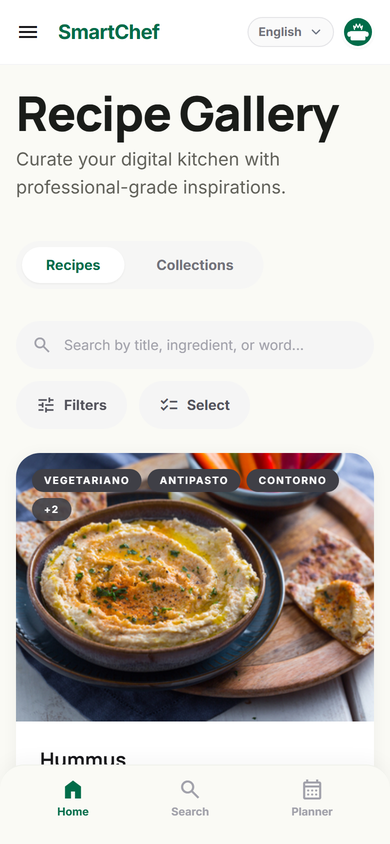
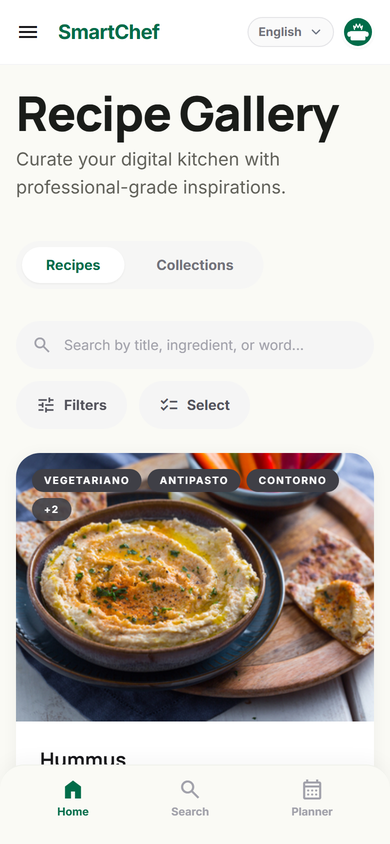
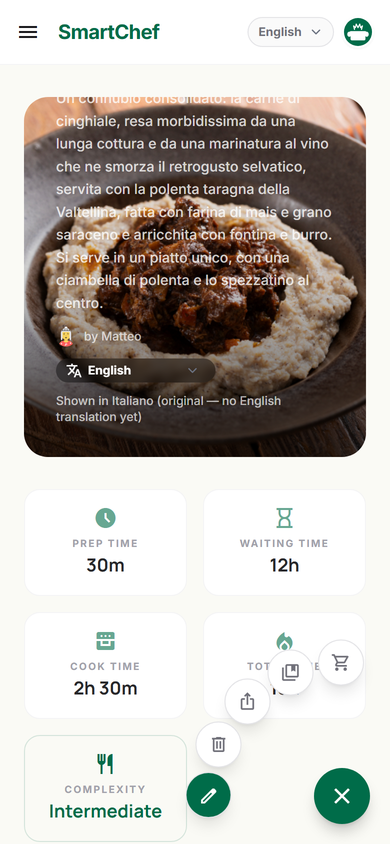

# 🍳 SmartChef

**A recipe library that works without the internet, belongs to you, and
understands that a recipe can be made of other recipes.**

Self-hosted or entirely server-less. Runs on Windows, Android, and anything
that can run Docker.


---

## What makes it different

**Recipes nest.** A lasagne is pasta, ragù and béchamel — each a recipe in
its own right, with its own ingredients and steps. Change the portions on
the lasagne and every sub-recipe scales with it, down through as many
layers as you like. That is the [Matrioska
engine](docs/architecture.md#-matrioska-engine), and it is the feature the
rest of the app is built around.

**It works with no server at all.** [Standalone
mode](docs/standalone-sync.md) keeps the whole library in a local database
on the device. If you want it on a second device, it replicates through a
folder you already sync (Syncthing, Dropbox, a USB stick) or through a
private git remote — merging field by field, not last-write-wins, so two
people editing two different things do not overwrite each other.

**Importing does not mean retyping.** Paste a URL, a photo of a cookbook
page, a PDF, or a voice note of someone dictating, and the model turns it
into a structured recipe — matched against the ingredients your library
already knows, so you do not end up with four spellings of "tomato". A
local model through Ollama works offline; Anthropic, Gemini and OpenAI work
if you would rather. See [Getting recipes in](docs/importing.md).

**Your data stays yours.** No account required, no telemetry, no cloud.
Backups are plain JSON. API keys never leave the device they were typed on,
and never enter a backup or a sync history.

---

## Install

### Windows desktop

Download `SmartChef-Setup-<version>.exe` from
[Releases](https://github.com/MGriot/smartchef/releases) and run it. No
server, no Docker, no configuration — it opens on an empty library and you
start adding recipes.

### Android

Download `SmartChef-<version>.apk` from
[Releases](https://github.com/MGriot/smartchef/releases), or add the
[F-Droid repository](fdroid/README.md) to get updates automatically.

See [the Android guide](docs/android.md) for reaching a home server from
outside the house.

### Server (Docker)

```bash
git clone https://github.com/MGriot/smartchef.git
cd smartchef
cp .env.example .env
docker compose up -d
```

The app is then at <http://localhost:5173>. Full instructions, including
running it without Docker, are in [Running SmartChef as a
server](docs/server-setup.md).

---

## What it looks like

A recipe: times, difficulty, where it comes from, scalable portions, and
the ingredients and tools each step needs.


Every place your recipes come from, on one map. Countries and regions are
drawn as areas; a town is a pin.


On a phone the gallery is one column, the search box gets its own row, and
the filters open as a sheet rather than a popover wider than the screen.




A recipe's own actions live in one button rather than a permanent bar over
the page, and fan out when you need them.



The step editor links ingredients, tools and techniques inline, so a step
knows what it needs rather than repeating it as prose. An ingredient can
carry substitutes, which scale and convert like the thing they replace.


---

## Documentation

| Guide | What it covers |
|---|---|
| [Running as a server](docs/server-setup.md) | Docker and manual setup, health checks, admin access, common problems |
| [Standalone mode and sync](docs/standalone-sync.md) | No-server mode, Sync Folders, git remotes, conflicts, profiles |
| [The Android app](docs/android.md) | Installing, Tailscale, building the APK |
| [Getting recipes in, and out](docs/importing.md) | Import from URL/photo/voice, the pantry, sharing a single recipe |
| [How it is put together](docs/architecture.md) | Project layout, API routes, the Matrioska engine, the MCP server |
| [What works today](docs/status.md) | Feature-by-feature status |
| [Android TV](docs/android-tv-evaluation.md) | An assessment of what TV support would take |
| [Design decisions](docs/adr/) | Why sync works the way it does (ADRs 0001–0006) |
| [Vocabulary](CONTEXT.md) | The words this project uses for its own concepts, and what they mean |

---

## Contributing

The domain vocabulary in [CONTEXT.md](CONTEXT.md) is worth five minutes
before changing anything in the sync engine — the words there are used
precisely, and the ADRs explain the trade-offs already made.

```bash
cd frontend && npm install && npm test
```

---

## License

[MIT](LICENSE).
