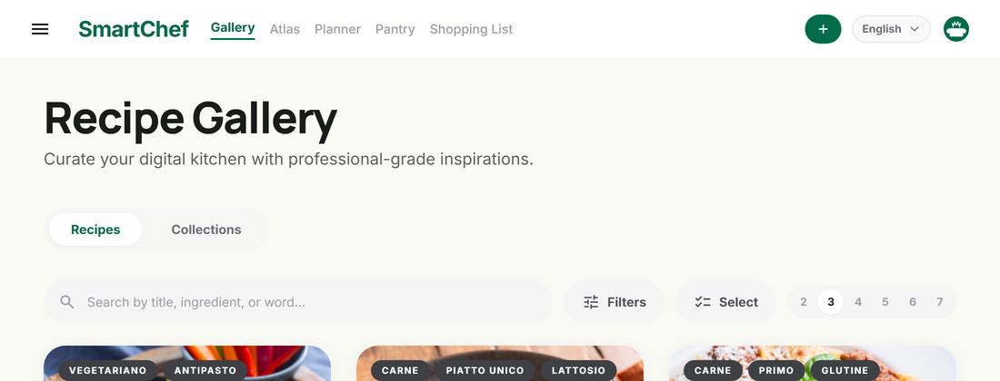
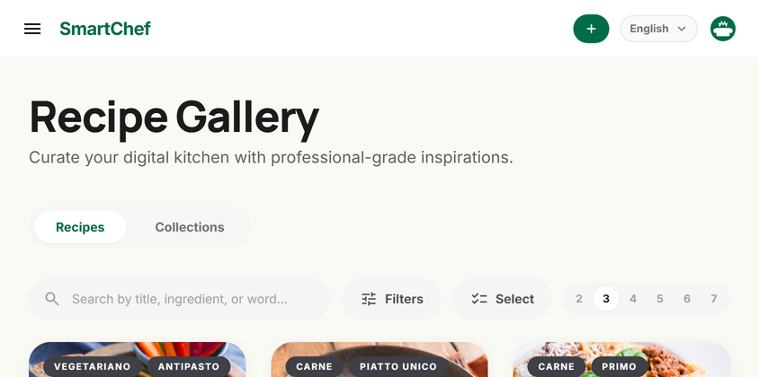

# How SmartChef is put together

What lives where, what the API offers, and the two pieces of machinery
that are not obvious from the folder names.

> Part of the [SmartChef documentation](../README.md#documentation).

---

## 🏗️ Project structure

```
smartchef/
├── docker/
│   ├── docker-compose.yml              # PostgreSQL + Backend + Frontend + MCP + Ollama
│   └── .env.example                    # Environment variables (copy to docker/.env)
├── docker-compose.yml                  # Thin root-level entrypoint, includes docker/docker-compose.yml
├── db/
│   └── migrations/                     # Sequential SQL migrations — full schema history
├── shared/
│   └── types/index.ts                  # Shared TypeScript types (backend ⇄ frontend ⇄ MCP)
├── backend/
│   ├── src/
│   │   ├── db/pool.ts                  # PostgreSQL connection pool
│   │   ├── middleware/requireAuth.ts   # Session-cookie auth guard (mounted on all of /api except /api/auth)
│   │   ├── routes/
│   │   │   ├── recipes.ts              # Recipe CRUD, portion scaling, LLM parse, cook-sequence, nutrition
│   │   │   ├── ingredients.ts          # Ingredients, categories, tools, units
│   │   │   ├── techniques.ts           # Cooking techniques library
│   │   │   ├── tags.ts                 # Managed tag catalog + auto-tagging rules
│   │   │   ├── collections.ts          # Freeform recipe collections
│   │   │   ├── menus.ts                # Weekly meal planner
│   │   │   ├── shopping.ts             # Shopping list generation + Markdown export
│   │   │   ├── auth.ts                 # Login/setup, multi-user (admin-invited), LLM provider config (session JWT cookie)
│   │   │   ├── share.ts                # Export/import a recipe or collection as a portable file
│   │   │   ├── publicShare.ts          # Public share links: an authenticated owner half, plus the app's only unauthenticated router
│   │   │   ├── pantry.ts               # Pantry CRUD (per account)
│   │   │   ├── sync-folder.ts          # Multi-device sync via a shared folder + native offline snapshot pull
│   │   │   ├── backup.ts               # Manual whole-library backup export/import
│   │   │   ├── cook-log.ts             # Cook-history calendar (GET /cook-log?from=&to=)
│   │   │   ├── geocode.ts              # Nominatim proxy for free-text region geocoding
│   │   │   ├── sync.ts                 # Legacy CRDT/vector-clock P2P endpoints — see "Multi-device sync" below
│   │   │   └── uploads.ts              # Image uploads (multer + sharp)
│   │   ├── services/
│   │   │   ├── matrioska.engine.ts     # ⭐ Recursive portion scaling across nested sub-recipes (incl. weight/volume-based sub-recipe yield)
│   │   │   ├── llm.parser.ts           # Provider dispatch (Ollama/Anthropic/Gemini/OpenAI) — recipe extraction, translation, ingredient-name translation
│   │   │   ├── llm.providers.ts        # Anthropic/Gemini/OpenAI API clients
│   │   │   ├── crypto.service.ts       # AES-256-GCM encrypt/decrypt for stored LLM API keys
│   │   │   ├── ingredient.matcher.ts   # Fuzzy match LLM output → DB (Levenshtein), auto-creates missing ones
│   │   │   ├── tags.service.ts         # Ingredient-driven auto-tagging
│   │   │   ├── nutrition.service.ts    # Per-serving nutrition calculation
│   │   │   ├── pantry.service.ts       # Pantry rows + "what can I cook?" matching
│   │   │   ├── importCatalog.service.ts # Library names for the import prompt to reuse instead of coining fresh wording (standalone twin: frontend/src/services/importCatalog.local.ts)
│   │   │   ├── folder-sync.service.ts  # Whole-library snapshot export/merge (multi-device sync + backups)
│   │   │   ├── device-identity.service.ts
│   │   │   └── crdt/vector-clock.ts    # Legacy — not wired into any write path, kept for the old sync.ts routes
│   │   └── index.ts                    # Express entry point
│   └── Dockerfile
├── mcp/
│   ├── src/
│   │   ├── backendClient.ts            # HTTP client against the backend REST API
│   │   ├── tools.ts                    # MCP tool definitions
│   │   └── index.ts                    # Entry point (Express + Streamable HTTP transport)
│   └── Dockerfile
└── frontend/
    ├── src/
    │   ├── pages/
    │   │   ├── Home.tsx                 # Gallery: search/filters, sort, adjustable grid density, Collections tab
    │   │   ├── RecipeCreate.tsx         # New recipe editor
    │   │   ├── RecipeDetail.tsx         # View/edit + Matrioska portion calculator + kitchen mode
    │   │   ├── RecipeImport.tsx         # AI import wizard (URL / raw text / portable-file import)
    │   │   ├── LibraryIngredients.tsx   # Ingredients + categories + translations
    │   │   ├── LibraryTools.tsx / LibraryUnits.tsx / LibraryTechniques.tsx / LibraryTags.tsx
    │   │   ├── Planner.tsx              # Weekly meal planner (drag-and-drop, @dnd-kit)
    │   │   ├── Pantry.tsx               # What's in the house + "what can I cook right now?"
    │   │   ├── Atlas.tsx                # Recipes on a world map, by region
    │   │   ├── ShoppingList.tsx         # Shopping list
    │   │   ├── CollectionDetail.tsx     # Recipe collection view
    │   │   ├── CookHistory.tsx          # Cook-history month calendar
    │   │   ├── Login.tsx / Account.tsx  # Auth + account settings (avatar presets, LLM provider), Backup & Restore, Multi-Device Sync
    │   │   ├── ManageUsers.tsx          # Admin-only: invite/list/remove instance users
    │   │   └── ServerConnect.tsx        # Native-app-only: connect to a remote SmartChef server
    │   ├── lib/importMatching.ts         # Merges fuzzy name matches with the AI's catalog claim for the import Review Matches step
    │   ├── lib/unitConvert.ts            # Display-only unit/temperature/tin-size conversion — never written back
    │   ├── lib/cookTimers.ts             # Step timers, module-level so leaving cook mode doesn't cancel the roast
    │   ├── lib/zipReader.ts              # Minimal zip/gzip reader for migration archives (DecompressionStream)
    │   ├── hooks/useWakeLock.ts          # Keeps the screen awake in cook mode, re-acquired on visibilitychange
    │   ├── services/recipeStructuredData.ts  # schema.org JSON-LD / microdata recipe extraction, tried before any LLM
    │   ├── services/pageFetcher.ts       # Fetches a page's HTML via the backend or the native bridge
    │   ├── services/migration/           # Paprika/Mealie/Crouton/Mela/Nextcloud/CopyMeThat importers, PDF text and on-device OCR
    │   ├── services/pantry.local.ts      # Standalone pantry + filter-by-pantry
    │   ├── components/Modal.tsx          # Shared dialog shell — pinned header/footer, one scrolling body, Escape stack, scroll lock
    │   ├── components/Form.tsx           # Field/section/translation-row primitives the dialogs are built from
    │   ├── fonts/                        # Generated Material Symbols subset (see scripts/subset-material-symbols.py)
    │   ├── lib/api.ts                   # apiFetch — same-origin on web, absolute+cookie'd on native, offline fallback/outbox, routes to standalone mode's local router when active
    │   ├── lib/offlineStore.ts          # Native SQLite cache + write outbox (server-mode Android's offline read cache)
    │   ├── lib/countries.ts             # Country code → centroid lat/lng for the region map
    │   ├── lib/standalone.ts            # Standalone-mode profile (display name, no password) + first-run init
    │   ├── lib/electronBridge.ts        # Renderer-side helpers for Electron's IPC bridge (folder picker, fs primitives)
    │   ├── lib/gitfs.ts                 # isomorphic-git fs adapter — @capacitor/filesystem on Android, IPC-to-main-process on Electron
    │   ├── lib/sync/gitSync.ts          # Folder Sync engine: git commit/pull + LWW merge for standalone mode
    │   ├── db/local.ts                  # Local SQLite datastore (standalone mode) — same query/queryOne/withTransaction shape as backend/src/db/pool.ts
    │   ├── services/*.local.ts          # Standalone-mode ports of the backend routes (recipes, ingredients/units/tools, backup import) — called directly, no HTTP layer
    │   ├── services/localRouter.ts      # Dispatches apiFetch calls to the *.local.ts services when standalone mode is active
    │   ├── components/AppLayout.tsx     # Shared header + sidebar navigation
    │   ├── components/RegionPicker.tsx   # Recipe geolocation chip picker
    │   ├── components/RegionsMap.tsx / AtlasMap.tsx  # Lazy shells; the Leaflet map and its 739 KB of country boundaries live in the *View.tsx files behind them
    │   └── store/app.store.ts           # Global state (Zustand)
    ├── scripts/subset-material-symbols.py  # Cuts the 3.9 MB icon font down to the ~350 icons the app names (run by `prebuild`)
    ├── android/                         # Capacitor Android project (native wrapper, see below)
    ├── electron/                        # Capacitor Electron project — the Windows desktop app (standalone mode section below)
    ├── nginx.conf                       # SPA routing + API proxy
    └── vite.config.ts
```

---

## 📡 API Routes

All routes below live under `/api` and (aside from `/api/auth/*`) require an authenticated session cookie. This is a resource-level overview, not an exhaustive endpoint list — see `backend/src/routes/*.ts` for the full set.

| Base path | Covers |
|-----------|--------|
| `/api/auth` | First-run setup, username/password login, logout, account settings (incl. LLM provider config), admin-only user management (`/users`) |
| `/api/recipes` | CRUD, `?q=&tag=&tags=&ingredientCategories=&regions=&difficulty=&sort=&seasonalOnly=&seasonalMonth=`, `/:id/portions?servings=N` (Matrioska), `/:id/cook-sequence`, `/:id/nutrition`, `/:id/rating`, `/:id/cooked`, `/:id/translate/:lang` (AI translation), `/:id/collections`, `/parse` (AI import), `/filter-by-pantry` (which recipes the pantry can cover, resolved through nested sub-recipes) |
| `/api/ingredients` | Ingredients (incl. `seasonalMonths`), `/categories`, nested `/api/units`, `/api/tools` |
| `/api/techniques` | Cooking techniques library |
| `/api/tags` | Managed tag catalog |
| `/api/collections` | Freeform recipe collections |
| `/api/menus` | Weekly meal planner |
| `/api/shopping` | Shopping list generation, item check-off, Markdown export |
| `/api/pantry` | What's in the cupboard: list, upsert by ingredient, remove |
| `/api/share` | Export/import a recipe, bulk recipes, or a collection as a portable `.smartchef.json` file; `/links/:recipeId` creates, reads and revokes a public share link |
| `/api/public` | **The only unauthenticated read path.** `/recipes/:token` returns an allowlisted projection of one shared recipe; `/r/:token` is a server-rendered HTML page, so a link pasted into a chat gets a real preview |
| `/api/sync-folder` | Multi-device sync status/trigger + native app's offline-cache snapshot pull |
| `/api/backup` | Manual whole-library backup export/import |
| `/api/cook-log` | Cook-history calendar (`GET ?from=&to=`), backing the "I cooked this" log |
| `/api/geocode` | Server-side Nominatim proxy for free-text region geocoding (cached) |
| `/api/sync` | Legacy CRDT/vector-clock P2P endpoints — see [Multi-device sync](#-multi-device-sync) |
| `/api/uploads` | Image uploads |
| `/health` | DB + Ollama status (no auth required) |

---

## 🧩 Matrioska Engine

Recipes can be nested infinitely. The engine recursively resolves every sub-recipe and aggregates ingredients scaled to the requested number of portions:

```
Gala Dinner (×10 people)
├── 500g   Egg pasta              ← plain ingredient  (×10/4 = ×2.5)
├── 3 srv  Mother Sauce           ← nested sub-recipe
│   ├── 1500g  Tomatoes           ← resolved: 500g × 3
│   └── 150ml  Olive oil          ← resolved: 50ml × 3
└── to taste  Salt                ← vague quantity → warning
```

```bash
GET /api/recipes/:id/portions?servings=10
```

---

## 🔌 MCP Server

A separate service (its own `package.json`, Dockerfile, and container — it doesn't run inside the backend process) exposes the recipe library via [Model Context Protocol](https://modelcontextprotocol.io), so an AI assistant can read and create recipes directly.

- Endpoint: `POST http://localhost:3002/mcp` (Streamable HTTP transport, stateless — each request opens its own MCP session)
- Doesn't touch the database directly: it calls the backend's own REST routes (`BACKEND_URL`, defaulting to `http://backend:3000` inside Docker)

Exposed tools:

| Tool | Description |
|------|-------------|
| `list_recipes` | Search/filter recipes (query, tag, difficulty, components) |
| `get_recipe` | Full detail of a recipe (ingredients, steps, tools, techniques) |
| `scale_recipe_portions` | Matrioska engine: recalculates quantities for N portions, resolving nested sub-recipes |
| `create_recipe` | Creates a new recipe with ingredients (incl. groups), steps (incl. tagged techniques), tools, storage instructions and tips |
| `update_recipe` | Updates an existing recipe's fields |
| `delete_recipe` | Deletes a recipe |
| `list_ingredients` / `list_ingredient_categories` | Browse the pantry |
| `list_units` | Units of measure and conversion factors |
| `list_tools` | Kitchen tools |
| `list_techniques` | Cooking techniques library |

To connect it to an MCP client (e.g. Claude Desktop) that requires a stdio transport, use a proxy like [`mcp-remote`](https://www.npmjs.com/package/mcp-remote) pointed at `http://localhost:3002/mcp`.

---

---

## One layout, every width

There is no separate mobile build and no separate mobile routes: the same
components render from a 375px phone to a desktop window, and the places
where that is not merely a matter of stacking are worth knowing about.

The header keeps to one row at every width. Between roughly 1024px and
1280px there is not room for all eight destinations *and* the page's own
actions, so the three least-frequent ones (History, Import, Library) stay
in the menu until there is — rather than letting the labels wrap the header
onto two lines, which is what used to happen, and which was worst in
Italian, French and Spanish where the labels are longest.



Below `lg`, a page's own actions leave the header entirely and become a
floating button that fans them onto an arc
(`frontend/src/components/FloatingActionBar.tsx`). That component carries
one constraint worth repeating: nothing wrapping its children may use a
`transform`, a `filter` or a `backdrop-filter`, because each of those makes
the wrapper a containing block for `position: fixed` descendants — and the
share and collection popovers inside those very buttons are fixed.

In landscape the gallery uses the extra width rather than stretching one
column across it.


