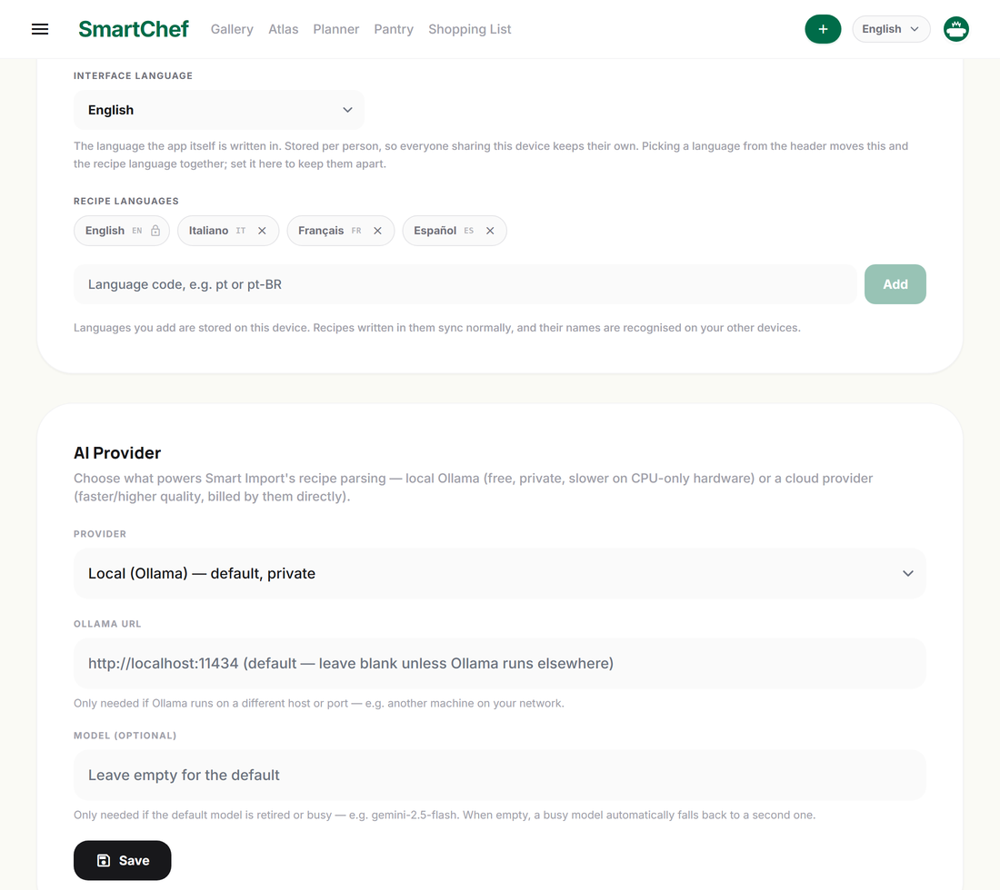

# Standalone mode and multi-device sync

No server, no database to run: the app keeps the whole library on the
device and, if you want it on more than one device, replicates it through
a folder or a git remote.

The vocabulary used throughout this page — Sync Folder, Hidden Clone,
Structured Merge, Conflict Policy — is defined once in
[CONTEXT.md](../CONTEXT.md), and the decisions behind it in the
[ADRs](adr/).

> Part of the [SmartChef documentation](../README.md#documentation).

---

## 🔄 Multi-device sync

Two independent mechanisms exist — worth being precise about which one actually does what:

**Folder-based sync (the one that works).** Each device writes a full-library snapshot (`smartchef-<deviceId>.json`) into a shared folder — a plain local folder, or one kept in sync by a desktop client like OneDrive/Google Drive. On every cycle, a device reads every *other* device's file and merges each row in by id, last-write-wins on `updated_at`. No central server, no pairing handshake. Enable it with `SYNC_ENABLED=true` + `SYNC_FOLDER_HOST_PATH` in `docker/.env`; status, peer list, and a manual "Sync Now" (with a per-entity change summary) are on the **Account** page. The same snapshot format also powers the **Backup & Restore** feature (manual export/import, independent of sync being enabled) and the native app's offline read cache.

*This is the server-mode mechanism, backed by the Docker/Postgres backend.* **Standalone mode** (no server at all — see [below](#-standalone-mode--windows--android-no-server)) has its own, separate Folder Sync built on real git commit history (`frontend/src/lib/sync/gitSync.ts`, via `isomorphic-git`) instead of snapshot files — same LWW-by-`updated_at` idea, different implementation, since there's no backend process to run the sync loop.

**CRDT vector-clock P2P (`/api/sync/*`, legacy).** An earlier, more ambitious design — direct device-to-device sync with field-level conflict detection via vector clocks (`services/crdt/vector-clock.ts`, `mdns.service.ts`). The endpoints exist and respond, but no mutating route in the app ever logs a local edit into the operation log, so there's nothing real for peers to exchange — it predates and was superseded by folder-based sync. Kept in the codebase but not used by the UI; retrofitting true per-operation CRDT logging into every write path would be a large separate undertaking.

**Native app offline editing.** Separate again from both of the above: the Android app keeps a local SQLite cache of the whole library and a write outbox for edits made without connectivity, replayed against the real API on reconnect — see `frontend/src/lib/api.ts`, `offlineStore.ts`, `offlineSync.ts`.

---

## 📴 Standalone Mode (Windows & Android, No Server)

Everything above assumes a running Docker/Postgres backend. SmartChef also runs **fully offline, with no server at all**: the Windows desktop app and the Android app can each keep their own local SQLite database, work indefinitely with zero connectivity, and — if you want more than one device — converge with each other through a shared folder using real git history instead of a central server.

### Building the apps

Both are built from the same `frontend/` React codebase via [Capacitor](https://capacitorjs.com); there's no hosted download, so build (or re-build) them yourself:

> **Build prerequisite:** `npm run build` regenerates the Material Symbols
> icon subset first (`prebuild` → `scripts/subset-material-symbols.py`),
> which needs Python with `fonttools` installed. Without them the build
> prints a warning and uses the committed `frontend/src/fonts/` copy, which
> is correct for the icons in the repo today — you only need Python if you
> have added new icon names to the source.

**Windows** (`frontend/electron/`, an Electron wrapper):
```bash
cd frontend
npm install
npm run electron:build
```
Produces an NSIS installer at `frontend/electron/dist/SmartChef Setup 1.1.0.exe`.

**Android**:
```bash
cd frontend
npx cap sync android
cd android
./gradlew assembleDebug
```
Produces `frontend/android/app/build/outputs/apk/debug/app-debug.apk` — install via `adb install app-debug.apk`, or transfer the file to the phone and open it directly (requires allowing "install from unknown sources").

> On Windows, `gradlew` reads `JAVA_HOME` before it ever gets to the JDK pinned in
> `android/gradle.properties`, so an inherited `JAVA_HOME` pointing at a JDK that
> isn't there any more aborts the build with a path nobody configured. Override it
> for the one command:
> `JAVA_HOME="C:\Program Files\Microsoft\jdk-21.0.12.101-hotspot" ./gradlew assembleDebug`

To try it on an emulator rather than a handset:

```bash
emulator -list-avds                     # pick one, or make one in Android Studio
emulator -avd <name> -no-snapshot-load &
adb wait-for-device
adb install -r frontend/android/app/build/outputs/apk/debug/app-debug.apk
adb shell am start -n com.smartchef.app/.MainActivity
```

### Publishing on F-Droid

The app is a good F-Droid candidate as-is: MIT licensed, no Google Play Services,
no `google-services.json`, no proprietary libraries, and the whole thing builds
from this repo. There are two routes, and they cost very different amounts of
work.

#### Building a signed release APK

Everything except the keystore itself is wired up. Generate one once:

```bash
keytool -genkey -v -keystore release.jks -keyalg RSA -keysize 2048 \
        -validity 10000 -alias release-alias
```

Then copy `frontend/android/keystore.properties.example` to
`keystore.properties` in the same folder and fill in the two passwords. Both
that file and `*.jks` are gitignored.

```bash
cd frontend && npm run build && npx cap sync android
cd android && ./gradlew assembleRelease
apksigner verify --verbose app/build/outputs/apk/release/app-release.apk
```

With no `keystore.properties` and no `SMARTCHEF_KEYSTORE*` environment
variables the release build still runs, it just produces an unsigned APK — a
contributor without the key is not blocked.

Two things worth knowing:

- **The keystore is the app's identity.** An app signed with a different key
  can never update an installed one, so losing it means every user has to
  uninstall and reinstall. Back it up somewhere that is not this repository.
- **Bump `versionCode` on every release.** It is the only number Android
  compares when deciding whether something is an upgrade; `versionName` is
  for humans. `minifyEnabled` is deliberately left off — see the comment in
  `app/build.gradle` for why R8 is risky for this particular app.

#### Route A — IzzyOnDroid (the least work, and it tracks GitHub releases)

[IzzyOnDroid](https://apt.izzysoft.de/fdroid/index/info) is a third-party
F-Droid repository most F-Droid users already have enabled. It does **not**
build anything: it takes the APK you attach to a GitHub release and re-serves
it, so after a one-off request every future tagged release is picked up
automatically.

Its [inclusion policy](https://izzyondroid.org/docs/general/AppInclusionPolicy/)
asks for an OSI/FSF licence, public source, no trackers, fastlane metadata
with a short description, full description, icon and screenshots — all of
which this repo has — and an APK **signed with a release key**, explicitly
not a debug one and not carrying `android:debuggable` or `android:testOnly`.

Request inclusion by opening an issue on their
[repodata tracker](https://codeberg.org/IzzyOnDroid/repodata) pointing at this
repository's releases. Note the request goes to *their* Codeberg; the release
itself stays on GitHub.

#### Route B — our own F-Droid repository (already built)

Full control, no review queue, and users add one URL:

```
https://mgriot.github.io/smartchef/fdroid-repo/repo
```

`.github/workflows/fdroid-repo.yml` builds and signs it. It runs on
`release: published`, so adding a version to the repo costs nothing beyond
publishing the release that already happens — it takes the APKs from the
releases themselves, which means the repo can never serve a build that was
not published.

Two details worth knowing, because both are the kind of thing that breaks a
repository silently:

- **Only APKs signed with the release key are published.** Every downloaded
  APK's certificate is compared against the release certificate's SHA-256 and
  dropped if it differs. Android identifies an app by its signing key, so
  serving the old debug-signed v1.0.0/v1.1.0 alongside a release-signed build
  would hand users an upgrade that cannot install.
- **The index is signed with a key that must never change.** If it is
  regenerated, every user has to remove and re-add the repository. That is
  why the workflow reads it from secrets and never calls `fdroid init`.

The output goes to an orphan `gh-pages` branch, so `master`'s history does
not grow by ~16 MB per release.

##### Setting it up (once)

1. Create the repository signing key — this is separate from the app signing
   key, and just as irreplaceable:

   ```bash
   keytool -genkeypair -v -keystore fdroid-repo-keystore.p12 -storetype PKCS12 \
           -alias fdroid-repo -keyalg RSA -keysize 4096 -validity 10000
   ```

2. Add three repository secrets (**Settings → Secrets and variables →
   Actions**). `FDROID_KEYSTORE_B64` is the keystore base64-encoded:

   ```bash
   base64 -w0 fdroid-repo-keystore.p12       # Windows: certutil -encode
   ```

   | Secret | Value |
   |---|---|
   | `FDROID_KEYSTORE_B64` | the base64 above |
   | `FDROID_KEYSTORE_PASS` | the store password |
   | `FDROID_KEY_PASS` | the key password |
   | `FDROID_KEY_ALIAS` | optional, defaults to `fdroid-repo` |

   Avoid `"` and `\` in those passwords — they are interpolated into the
   generated `config.yml`.

3. Run the workflow once (**Actions → F-Droid repository → Run workflow**),
   then set **Settings → Pages** to serve from the `gh-pages` branch, root.

Back the keystore up somewhere that is not this repository, and keep it: it
is the only thing that lets an existing user receive an update.

##### Rehearsing a change

`Run workflow` has a **dry_run** option that builds the whole index with a
throwaway key and publishes nothing. Useful before the secrets exist, and for
checking a metadata change without touching what users are subscribed to.

(`fdroid-repo/` is the published output; `fdroid/` holds the submission files
for Route C below.)

#### Route C — the official f-droid.org repository (weeks, mostly waiting)

Widest reach, and F-Droid builds the APK itself on its own build server and
signs it with its own key, so nothing of yours is trusted beyond the source.
You open a merge request against
[`fdroid/fdroiddata`](https://gitlab.com/fdroid/fdroiddata) adding
`metadata/com.smartchef.app.yml`.

**That submission is already prepared in this repo** — see
[`fdroid/README.md`](fdroid/README.md). It has the finished build recipe
(`fdroid/metadata/com.smartchef.app.yml`), a checklist of every requirement in
F-Droid's quick-start guide against what this repo already satisfies, and the
exact `git`/`fdroid` commands for the fork and the merge request. The app's
own store listing — descriptions, changelog, icon and screenshots, in English
and Italian — lives in [`fastlane/metadata/android/`](fastlane/metadata/android/),
which is where F-Droid reads it from.

The awkward part, documented there in full: the APK is a Capacitor shell
around a Vite build, so **Node has to run before Gradle does** and F-Droid's
build server has no Node by default. It goes in `sudo:` and `build:` — not
`prebuild:`, because the source scanner runs between the two and `npm ci`
would drop a `node_modules` full of binaries into its path.


### Something to look at on first run

A fresh install opens on an empty gallery. [`samples/`](samples/) holds a real
exported library — 46 recipes, 239 ingredients, the tag and technique
catalogues — that loads through **Account → Backup & Restore → Restore from
Backup**. [`samples/README.md`](samples/README.md) explains exactly what
restoring does to a library you already have: it merges by id, never deletes,
and is safe to run twice.

### First run: standalone vs. server

On first launch, both apps ask **"Connect to a server"** (the Tailscale setup described below), **"Use offline on this device,"** or **"I have a setup file."** Choosing offline asks for a display name and an optional avatar — no password, since each device's local data is already private to whoever holds the device. The third option is for a device joining a household that is already set up — see [Setup Files](#setup-files--configuring-a-second-device) below. It is offered only on this first-run screen, so a device that is already configured is never asked about it again.

### Household Profiles — more than one person sharing a standalone library

Standalone mode isn't limited to one name per device. **Profiles** (who's currently using the app — for labeling recipes you create and cooks you log) are their own synced entity, distinct from **Local Storage** and the **Sync Folder** below: a profile created on one device becomes pickable on every other device sharing the same Sync Folder, the same way a recipe or ingredient does.

- **Creating the first profile**: the "Use offline on this device" screen asks for a name (+ optional avatar) and creates the first profile — same as any first-run today.
- **Joining an existing household**: if you point a *new* device at a Sync Folder that already has profiles synced into it (choose the folder before finishing setup), the app syncs once and offers **"pick who you are"** instead of forcing a redundant new profile — pick an existing one, or still create a new one if this is genuinely a new person.
- **Switching who's using a shared device**: Account → **Switch Profile** brings back the "Who's cooking?" picker without touching the local library, the Sync Folder, or any other profile — distinct from **Log Out**, which forgets this device's standalone setup entirely.
- **Each profile keeps its own interface language**: Account → **Languages** → *Interface language*. Two people sharing one device no longer overwrite each other's choice, and the setting is remembered per profile rather than per device. It is separate from the **recipe language** (what recipes are read and written in), which was already per profile: the picker in the header still moves both at once, which is the right default, and this setting is the way to keep them apart — reading recipes in Italian with the app itself in English, say.



### Getting your existing recipes into a fresh standalone install

If you already run the server-mode Docker stack with a real library built up, you don't have to re-create it by hand on a new standalone device:

1. On the **server-mode** instance (the one with your data, e.g. `http://localhost:8888`), go to **Account → Backup & Restore → Export Backup**. This downloads one JSON file containing your whole library — recipes, ingredients, tools, tags, ingredient categories, and cooking techniques, with all translations.
2. On the **new standalone device** (Windows or Android), finish the offline first-run setup, then go to **Account → Backup & Restore → Restore from Backup** and pick that same JSON file.

Restoring is additive, not destructive, and safe to run more than once: every item is matched by its original id, so anything already present locally is left untouched rather than duplicated or overwritten — importing the same backup twice, or two backups that partially overlap, is a harmless no-op for whatever's already there.

Standalone mode's own **Export Backup** button is intentionally not available — Folder Sync (below) is standalone's real, continuous backup mechanism instead of a one-shot file, and it also gives you full history. Restore still works normally in standalone mode either way, specifically for pulling data in from an existing server-mode library like this.

### Folder Sync — converging multiple standalone devices

Standalone devices never talk to each other directly, and never require both to be online at once. Local Storage — the live SQLite database + images every screen actually reads and writes — is always a fixed, per-platform location (`Documents/SmartChef` on Windows; a private app-data folder on Android), not something you pick. How devices actually exchange changes is a choice, set per device in Account → Folder Sync (or noted during first-run setup): **Folder mode** (the original design) or **Git Remote mode**.

**Folder mode** points at a *separate* location — a plain local folder, a mapped network drive/SMB share, or a folder already kept in sync by [Syncthing](https://syncthing.net), OneDrive, Google Drive, or Dropbox's desktop client. On Android this is the system's folder picker (Storage Access Framework) instead, which can point at the same kinds of targets via whichever apps expose a folder handle to it — Syncthing is the most reliable option here, since the mainstream cloud-storage Android apps don't genuinely keep an arbitrary folder two-way synced the way their desktop clients do.

Under the hood, a Folder-mode Sync Folder is a **bare-style git remote** — it only ever holds git objects and refs, never a checked-out working tree. Each device keeps its own private **Hidden Clone** (a real git repository, invisible in the UI, distinct from both Local Storage and the Sync Folder) where every local change gets committed. Syncing pulls the Hidden Clone against the Sync Folder over a hand-rolled object/ref transport (isomorphic-git's own fetch/push only speak HTTP, and a Sync Folder is just files on disk) before ever pushing — never the other way around, so a device can't overwrite the shared ref before it's looked at what's actually there — then pushes with a compare-and-swap check so a concurrent write from another device is detected and retried, not silently clobbered. Object transfers run several at a time (not strictly one-by-one) to keep sync fast even against a transport with real per-call overhead, like Android's Storage Access Framework — and if a device's own folder listing ever looks incomplete (the Google Drive/Android case above), it automatically falls back to downloading a single git-bundle-format snapshot instead of enumerating objects one by one, rather than merging against a silently partial view.

**Git Remote mode** points at a real git server instead — GitHub, GitLab, or self-hosted — reached over git's actual push/fetch protocol (Account → Folder Sync → Git Remote: repository URL, optional username, an access token). Unlike most git-in-the-browser tools, this doesn't need a CORS proxy for GitHub/GitLab — the request runs through native code (Electron's main process, or a small Android plugin), which was never subject to the browser's CORS policy in the first place, the same trick this app already uses for filesystem access. No file-sync tool is in the loop at all in this mode either way: the server owns atomic ref updates natively and always knows its own true object set, so the failure modes above (ref races, incomplete listings) don't apply. See [ADR 0004](adr/0004-git-remote-sync-mode.md) for the full story, including the public CORS-proxy dead end this replaced.

Both modes run **Structured Merge** — a field-by-field three-way merge, not git's textual merge — to reconcile whatever changed on both sides since they last agreed. A field genuinely edited on both devices becomes a **Conflict**, surfaced in its own list (Account → Folder Sync) for you to resolve rather than silently auto-picked; everything else about that sync still finishes normally. Covers recipes (steps, ingredients, ingredient groups, tagged techniques included), ingredients, tools, tags, cooking techniques, and household profiles — deletions propagate as tombstones the same way any other edit does. Device-record tracking ("Known Devices") is Folder-mode-only for now; Git Remote mode doesn't show it.

Once two devices are pointed at the same Sync Folder or git remote — however it got that way — Account → **Sync Now** pushes local changes and pulls in whatever changed elsewhere; a recipe created on one device shows up on the other the next time both sync. How often that happens automatically (besides on app resume and a manual Sync Now) is also configurable there, per device — a value plus a unit (minutes/hours/days/weeks/months, e.g. "every 3 days"), not just minutes. The full commit history is browsable on either device at Account → Folder Sync → **History**. See [`CONTEXT.md`](./CONTEXT.md) for the full glossary of these terms and [`docs/adr/`](adr/) for the architecture decisions behind them.

### Setup Files — configuring a second device

Pointing the *second* device at the same place as the first means reproducing what the first one already knows, and in Git Remote mode that includes an access token: forty-odd characters of opaque base62, typed on a phone. A **Setup File** carries it instead.

Account → Folder Sync → **Export Setup File** asks for a passphrase and writes one file containing this device's Sync Mode, its auto-sync interval, and its repository URL, username and access token. On the other device, choose **"I have a setup file"** on the first-run screen (or Account → Folder Sync → **Use a Setup File** later), pick the file, type the same passphrase, and the sync settings are filled in. In Git Remote mode the app then goes straight on to look for profiles the other devices have already synced, so the new device lands on "pick who you are" rather than being asked to invent a duplicate profile.

Three things worth knowing:

- **The passphrase is the security.** The file is AES-256-GCM with the key derived from your passphrase, in a format only SmartChef parses. There is no recovery — a forgotten passphrase means exporting again from the original device. A deliberate design choice, not an oversight: the alternative (a key built into the app, so the file just opens) ships that key inside every APK and installer, which would mean a leaked file gives up a token with write access to your library. [ADR 0005](adr/0005-encrypted-setup-file.md) has the full argument.
- **The Sync Folder is not in it.** A folder path on Windows and an Android folder permission are per-device handles that mean nothing anywhere else, so a Folder-mode device still picks its own folder after importing — the app says so rather than letting you discover it when nothing syncs.
- **It contains no recipes.** A Setup File is configuration only; Backup & Restore is what moves a library.

The file is a real secret for as long as it exists, and it is not deleted after import — configuring several devices from one file is the normal case — so delete it yourself when you are done.

---
